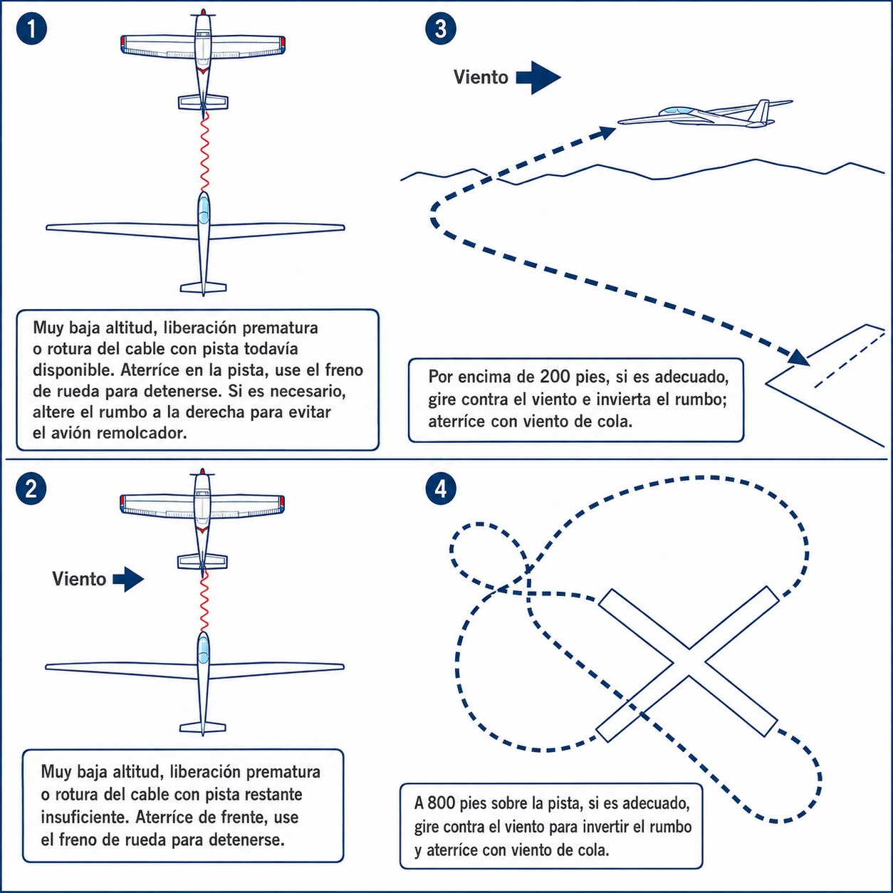
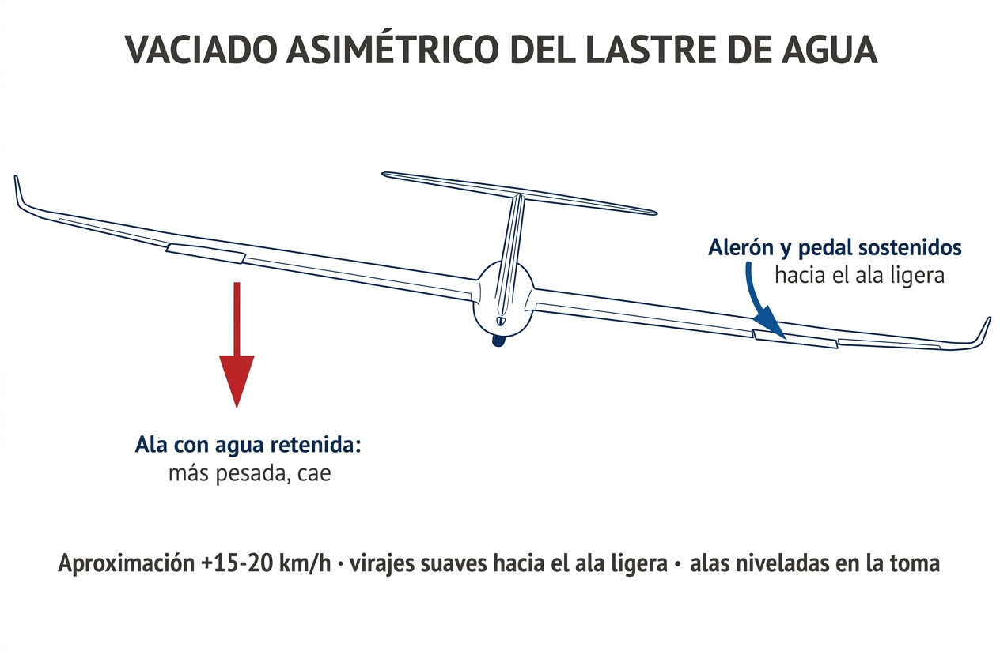

# Emergency procedures

> Emergencies in flight are not handled by improvising: they are handled by training. The difference between an emergency that ends with the sailplane on the ground and the crew unhurt, and one that ends in an accident, is often measured in one or two seconds of reaction time and in whether the correct procedure had become automatic. This chapter describes the most frequent emergencies in gliding and the exact procedure for each.
>
>
> In this chapter you will learn:
>
>
> * **Launch emergencies**: what to do after a cable break, a tow failure or a jammed release (**towhook jam**).
> * **Fire on board**: the procedure in motorgliders and how to clear smoke.
> * **Structural and control failures**: what to do when a control does not respond, with abnormal vibration or with unbalanced ballast.
> * **Instrument and system failures**: how to respond to blocked pressure ports and to the canopy opening in flight.

## Launch emergencies

The launch phase concentrates the greatest risk in sailplane flying. The combination of low height, rapid acceleration and dependence on an outside system (the winch cable or the tug) opens a window of vulnerability in which any failure demands an **instinctive, immediate response, without hesitation**.

The universal golden rule for any launch emergency is:

* **First:** lower the nose to the gliding attitude to regain speed and avoid a stall.
* **Second:** release the cable (if it has not come off automatically).
* **Third:** assess the height available and choose a landing option.

This order of priorities never changes. Whatever the particular emergency, speed is always the first thing to secure.

### Cable break or tow failure

After a **launch failure** (a winch cable break or a tug engine failure), the pilot's reaction must be immediate and automatic. Instructors in Spain structure the emergency response around the Spanish mnemonic **the 3 P**:

1. **Palanca (stick):** push the stick forward at once (nose down) to settle the sailplane in a normal gliding attitude. In the steep climbing attitude the speed falls dramatically, and a delay of more than two seconds in lowering the nose will cause an imminent stall.
2. **Pulsador (release knob):** pull the cable release hard two or three times. That makes sure the broken cable comes right off the sailplane and you are not trailing pieces that could catch on obstacles on the ground (fences, crops) during the approach.
3. **Pensar (think):** assess the height available, the runway remaining and the wind, so as to carry out the matching decision in a fraction of a second.

The tactical decision depends directly on the height AGL reached when the failure happens and on the launch method used, because the rate of climb and the horizontal distance from the runway differ greatly between the winch and the tug (@fig-06-cap07-emergencia-altura):

* **On a winch launch:** the climb is very steep and the sailplane gains height very close to the start of the runway. The safety decision bands are:
* **Low height (below 150 m AGL):** keep the sailplane straight ahead, settle at the safe gliding speed and land on the remaining runway or in the clear fields ahead. **Trying to turn back to the runway below this height is strictly forbidden**, because of the high nose attitude and the imminent danger of a spin.
* **Critical height (between 150 m and 200 m AGL):** if there is not enough runway left ahead, fly at a safe speed and make a short, very tight circuit. Start the turn with a medium coordinated bank (30° at most), adapting it to the wind so as to make sure the final leg is into wind.
* **Safe height (above 200 m AGL):** settle at the gliding speed and fly a standard abbreviated circuit.
* **On aerotow:** the climb-out is flatter and the sailplane moves horizontally well away from the departure runway. The decision bands are:
* **Low height (below 70 m, ≈230 ft AGL):** land straight ahead on the remaining runway or in clear fields ahead, avoiding obstacles with small changes of heading (30° at most).
* **Critical height (between 70 m ≈230 ft and 150 m ≈490 ft AGL):** assess the length of runway and the wind. If you have to turn back, start the turn **towards the crosswind component**, coordinated and with a firm bank of about 45°: the wind carries you back towards the extended runway centreline during the turn, whereas turning downwind lengthens the path and the height lost. If turning back does not pay, fly a shortened approach to the safest alternative field.
* **Safe height (above 150 m ≈ 500 ft AGL):** fly a shortened or normal circuit.

{#fig-06-cap07-emergencia-altura}

::: {.callout-note title="Airmanship: THE DECISION TO LAND OUT"}
After a launch failure at a critical height, **landing outside the aerodrome boundary (a forced landing straight ahead) is always better than trying to force a turn back at low height**. Forcing the turn to “save” the sailplane and get back to the runway is the main cause of fatal stalls and spins.
:::

::: {.callout-warning title="Safety: “THE IMPOSSIBLE TURN”"}
Trying to get back to the aerodrome by turning through 180° at low height (known in aviation as “the impossible turn”) is the documented cause of most serious take-off accidents. The geometry of the glide does not allow it: a turn at low height uses energy and height that you do not have. **If you are below the critical height set (150 m on the winch and 70 m on aerotow) and there is no runway left ahead, land straight ahead in open country. Always!**
:::

### Release failure / towhook jam

If on aerotow you try to release and the release knob does not respond (the cable stays attached), you have a **release failure**. It is a high-priority coordinated emergency that needs a standard visual signal to communicate with the tug pilot.

Apply the following procedure at once:

1. **Signal the emergency:** tell the tug by radio or, if there is no reply, move to a position **low and to the left** of the tug and rock your wings repeatedly and firmly. Never climb above the normal tow position to attract attention: climbing pulls the tug's tail up (**kiting**) and can drive its nose into the ground. It is the deadliest emergency there is for a tug pilot.
2. **The tug's response:** when the tug pilot sees your signal, they will try to operate their own release to free the cable from their end.
3. **Freeing the cable:** if the tug manages to release the cable, you will return to the aerodrome with the tow rope hanging from your sailplane's hook.
4. **Approach and landing with the rope:** when you fly back with the rope hanging (it is usually 50 to 60 metres long), plan a final approach that is well above normal. It is critical to make sure that the hanging rope safely clears any obstacle before the runway (airfield fences, hedges, roads, telephone or power lines).
5. **If the tug cannot release either:** in the extreme case where both hooks are jammed, you will have to make a coordinated descent and landing together, in formation with the tug, following the radio instructions.

::: {.callout-warning title="Safety"}
When you fly an approach with the rope hanging, **under no circumstances fly a low approach**. The rope could catch on a fence or power line before the runway threshold, causing violent deceleration and an uncontrolled impact of the sailplane with the ground (**pitch-up** or an instant stall). Keep a generous height margin until you are past the threshold.
:::

## Fire on board

In motorgliders (**Motorsegler**) or self-launching sailplanes, fire is an extremely grave threat. The composite materials of the structure (carbon, glass fibre, resins) give off highly toxic fumes that can incapacitate the pilot in under thirty seconds.

The priority is threefold and simultaneous: **cut off the fuel**, **clear the cockpit of smoke** and **land at once**.

1. **Engine:** switch off the ignition, close the fuel valves and switch off the electrical system to remove any arcing that could feed the fire.
2. **Ventilation:** if the smoke is not dense, open the cockpit air vents to direct the smoke outside. If the smoke is dense and unbreathable, consider jettisoning the canopy in flight to force ventilation.
3. **Landing:** land immediately in the nearest field. Do not try to reach the aerodrome if that delays the landing by several minutes. A sailplane with an active fire is not a safe sailplane.

::: {.callout-note title="Airmanship"}
Get to know where the fuel valves and the fire extinguisher are in your motorglider before your first flight. A fire emergency leaves no time to look through manuals or to remember where the emergency controls are. Muscle memory is trained on the ground, not in the air.
:::

## Structural and control failures

### Control jam or failure

A partial jam of the controls in flight (from a loose object in the cockpit, an internal breakage or a mechanical failure) does not necessarily mean total loss of control. Modern sailplanes have surfaces that can partly stand in for one another:

* **Aileron jam:** the rudder (pedal) produces a secondary roll through the **dihedral effect**: as the sailplane yaws, the advancing wing gains incidence and produces more lift, which induces a roll that may let you level the wings and make a controlled landing. The response is weaker than with the ailerons, but it is there.
* **Elevator jam:** the elevator trim, if the sailplane has one, can control pitch. Adjust the speed by opening or closing the airbrakes.
* **Total control jam:** if no surface responds and the flight cannot be controlled, the procedure is to abandon the aircraft (see Chapter 8: Emergency parachute).

### Flutter (structural vibration)

**Flutter** is a self-sustaining aeroelastic vibration that occurs at high speed, when the aerodynamic response and the structural inertia of the wing or tail surface fall into resonance. It is not a gentle rattle: it is an explosive vibration that can destroy the affected surface within seconds.

The most frequent causes are excessive speed (exceeding V~NE~ (never exceed speed), or approaching it in a dive), earlier structural damage or poor balancing of a control surface after a repair.

::: {.callout-warning title="Safety: FLUTTER"}
If you experience strong, uncontrolled vibration, **reduce speed at once**: raise the nose gently and open the airbrakes to brake aerodynamically. *Flutter* only occurs at high speed and can destroy the sailplane in seconds. Never try to increase speed to “get out” of a vibration: it is exactly the opposite of what you need. After any episode of abnormal vibration, the sailplane must be inspected by an engineer before it flies again.
:::

### Flight instrument failure (pitot or static)

A blockage of your sailplane's pressure ports (usually by condensed rainwater, insects or covers forgotten after the pre-flight) completely changes the readings on the instrument panel. You need to be able to tell which port is blocked and how to fly safely without reliable instrument references.

* **Pitot tube failure (total pressure):**
* **Symptom:** the airspeed indicator drops to zero in level flight, or it behaves in reverse, acting like an altimeter (the indicated speed rises as you climb and falls as you descend).
* **Flying technique:** fly purely by eye, controlling the **pitch attitude** against the horizon. Tune in to the **sound of the air** around the cockpit (open the side clear-view panel or the vents slightly to get used to the sound that goes with the best glide speed). Pay attention to the **feel and resistance of the controls** (the slower you go, the softer and less responsive the stick feels).
* **Static port failure:**
* **Symptom:** the altimeter freezes at a fixed reading and the variometer stays at zero, not responding to climbs or descents. The airspeed indicator will also read wrongly because of the static pressure trapped in the instrument lines.
* **Flying technique:** if your sailplane has an **alternate static source** in the cockpit, select it with the appropriate valve.

::: {.callout-note title="Airmanship"}
If all the instruments fail in the circuit, trust your visual judgement of the glide angle towards the touchdown point completely. Keep a conservative nose attitude, guard against the stall by making sure there is a good airflow (a steady sound of air in the cockpit) and do not try to correct by eye against an airspeed indicator you know to be blocked.
:::

### Canopy opening in flight

If your sailplane's canopy was not properly latched during the pre-flight checks (the `CB-SIFT-CBE` checklist), it can suddenly open in flight because of aerodynamic forces or turbulence. This usually happens on tow or shortly after release. The noise of the wind and the sudden whirl of air inside the cockpit can cause panic and lead the pilot into serious mistakes.

The safety procedure calls for the following immediate actions:

1. **Fly the sailplane first (Aviate):** your absolute priority is to keep control of the aircraft. Ignore the canopy completely for the first few seconds. **Do not try to close it or hold it** if you are at low height or in a turn: you would lose your attention on flying and could induce an unusual attitude or a stall. Your sailplane can go on flying perfectly well with the canopy open.
2. **Put up with the noise and the whirl:** the noise will be deafening and loose objects will be flying around the cockpit, but the sailplane will go on flying perfectly well. If you are wearing sunglasses and your harness is tight, you will be safe.
3. **Set up a steeper glide path:** an open or partly detached canopy causes a **massive increase in drag**. Your glide angle will get considerably worse. To hold the safe speed you will have to fly more nose-down (a steeper approach path and a higher rate of sink).
4. **Plan the landing:** if you are on take-off, carry on with a steady tow to a safe height if possible, or release and fly a normal circuit. Fly a circuit adapted to a higher rate of sink and land at the aerodrome as soon as possible. Only try to close the canopy if you are at a good safe height, in coordinated flight and with one hand, without ever stopping flying the sailplane.

::: {.callout-warning title="Safety"}
Never stop flying the sailplane to try to hold or close a canopy that opens in the circuit or at low height. Many fatal accidents have happened because the pilot let go of the stick to grab the canopy with both hands, and the sailplane stalled and spun out of control, or lifted the tug's tail and drove it into the ground. Let the canopy float or come off if necessary: concentrate only on flying!
:::

### Asymmetric water ballast dumping

Water ballast (**water ballast**) in the wings improves performance at high speed on cross-country flights. However, if one of the wing valves jams or leaks when you start to dump (**dumping**), the sailplane will empty unevenly. That creates a considerable sideways imbalance in weight, with one wing much heavier than the other.

The pilot must manage this asymmetry with the following technique:

* **Effect on control:** the sailplane will roll strongly towards the side of the wing that still holds water. You will need constant, significant aileron and rudder pressure (sustained crossed controls) to keep the wings level, which reduces the lateral control you have left.
* **Higher approach speed:** increase your standard approach speed by at least **15–20 km/h** above the speed worked out for the circuit. The extra speed is essential for the ailerons to keep enough authority to counter the rolling tendency of the heavy wing, and to prevent a **tip stall** on the loaded wing in turns.
* **Planning the circuit:** avoid steep turns (15° to 20° of bank at most). Make gentle, coordinated turns into the circuit. Whenever possible, plan your turns towards the light wing: turning towards the heavy wing makes it harder to recover from the bank.
* **Landing with wings level:** during the round-out and touchdown, your top priority is to have the wings perfectly level at the moment of contact. Touch down on the main wheel first and, once on the ground, do everything you can to stop the water-laden wing dropping and touching the ground while the sailplane is still moving fast: it would cause a violent **ground loop** (@fig-06-cap07-lastre-asimetrico).

{#fig-06-cap07-lastre-asimetrico}

::: {.callout-warning title="Safety"}
A wing loaded with tens of litres of water has a much higher stall speed than the empty wing. With asymmetric dumping, if you let the speed fall too far on final or in the turn onto base, the heavy wing will stall suddenly and asymmetrically, causing an instant **spin** that cannot be recovered at low height. Holding the recommended circuit speed is your absolute defence.
:::

::: {.callout-important title="Regulation"}
The decision heights in this chapter (150 and 200 m on the winch; 70 and 150 m on aerotow) and the decision ladder for outlandings are **reference values for training**, not regulatory figures: the real critical height for each sailplane is set by its AFM and by the local instructions for the airfield (runway length, obstacles, usual wind). Learn them as an order of magnitude and adjust them to your aircraft and your aerodrome with your instructor.
:::

As a quick revision card, this table sums up the immediate response to each emergency in the chapter (the details are in each section):

| Situation | Immediate action |
| --- | --- |
| Cable break (any method) | Lower the nose to regain speed; then release and decide according to height. |
| Release failure / towhook jam | Move low and to the left of the tug and rock your wings; never above it (**kiting**). |
| Fire on board | Cut the electrics or the fuel, depending on the source; land as soon as possible. |
| Control jam | Replace the lost control (dihedral for roll, trim + airbrakes for pitch). |
| Flutter | Raise the nose and open the airbrakes to slow down at once; never speed up. |
| Pitot / static failure | Fly by visual attitude and the sound of the air; ignore the affected instrument. |
| Canopy opening in flight | Fly the sailplane first; lower the nose; do not try to close it if you are low. |
| Asymmetric ballast dumping | +15–20 km/h in the circuit, gentle turns towards the light wing, wings level at touchdown. |
: Symptom → immediate action in the emergencies of this chapter

::: {.postit}
**Chapter summary: emergency procedures**

* **Universal rule**: in any launch emergency, the first thing is always to **lower the nose** to regain speed and avoid a stall. Then release the cable and decide.
* **Cable break by launch method**:
  
  * **Winch**:
    * **< 150 m**: land straight ahead. Do not try to turn.
    * **150–200 m**: a short, tight circuit adapted to the wind.
    * **> 200 m**: a normal circuit.
  * **Aerotow**:
    * **< 70 m**: land straight ahead.
    * **70–150 m**: turn back or fly a shortened circuit (the turn back starts towards the crosswind, with a firm bank of about 45°).
    * **> 150 m**: an abbreviated or normal circuit.
* **“The impossible turn”**: trying to get back to the runway at low height is lethal. If you are below the critical height (150 m on the winch / 70 m on aerotow) and there is no runway left, land ahead.
* **Hook failure (aerotow)**: if you cannot release, move **low and to the left** of the tug and rock your wings to warn the pilot; never above, or you would lift the tug's tail (**kiting**). The tug will release. Land with the rope hanging, planning a high final to clear fences and obstacles.
* **Flutter**: with destructive vibration, **raise the nose and open the airbrakes** to reduce speed at once. Never speed up. Mandatory inspection on the ground.
* **Instrument failures**: with the pitot blocked, fly by visual pitch attitude and by the sound of the air in the cockpit.
* **Canopy opening**: fly the sailplane first (**Aviate**). Do not try to close it if you are low. Lower the nose to counter the extra drag.
* **Asymmetric ballast**: fly 15–20 km/h faster in the circuit to keep the ailerons effective, and keep the wings level at touchdown.
:::
