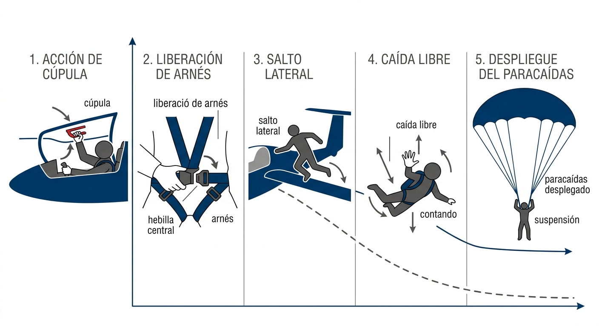
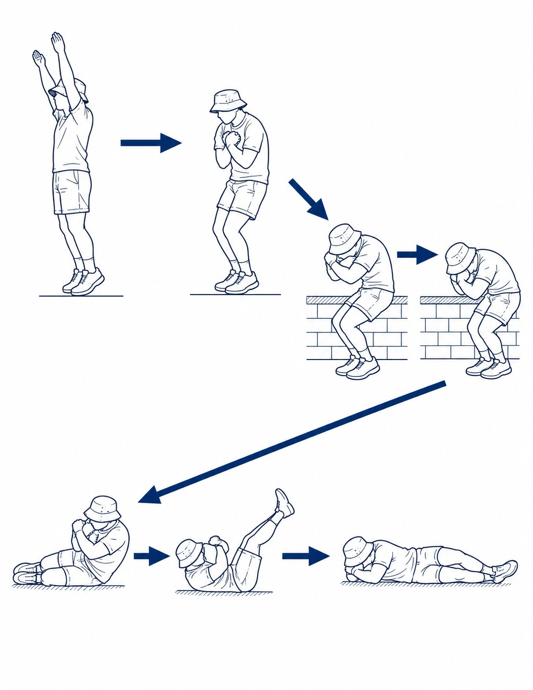

# Emergency parachute operation and landing

> The **emergency parachute** is the pilot's last resort when the sailplane has stopped being a safe means of transport. It is not equipment you use “just in case”: you use it when the alternative is to die inside the aircraft. Understanding when the situation justifies jumping, how to carry out the bail-out sequence and how to handle the descent and landing makes the difference between surviving and not. This chapter also covers the correct maintenance of the parachute: a neglected parachute is one that may not open.
>
>
> In this chapter you will learn:
>
>
> * **The decision to jump**: in which situations abandoning the sailplane is the only correct option.
> * **The minimum bail-out height**: why 150 metres is a threshold that cannot be lowered.
> * **The bail-out procedure**: the exact five-step sequence for leaving the cockpit.
> * **The descent and landing**: how to land under a parachute, in wind and among obstacles.
> * **Parachute maintenance**: care, storage and when the inspection runs out.

## The bail-out decision

Abandoning the sailplane (the **bail-out**) is a decision taken when the sailplane can no longer be controlled and there is no longer any option for a safe landing. The situations that justify a bail-out are:

* **Structural failure:** failure of a load-bearing part (wing, fuselage, tail) that makes the sailplane uncontrollable.
* **Mid-air collision:** damage that prevents controlled flight.
* **Uncontrollable fire:** a fire that cannot be put out and makes the cockpit uninhabitable.
* **Unrecoverable loss of control:** a **spin** or an uncontrolled spiral that cannot be stopped with the means available.

The psychological key to the bail-out is to understand that **if the sailplane is still flying under control, the pilot must stay inside**. A sailplane with partial controls, an engine failure in a self-launcher or flight degraded by icing do not justify jumping: those situations are handled by heading for the nearest landing. The parachute is the answer only when the sailplane is no longer one.

### Minimum bail-out height

The recommendation is to start the bail-out at least **150 metres** above the ground. The figure is not arbitrary:

* An emergency parachute needs between 50 and 90 metres to open fully from the moment the handle is pulled.
* The bail-out itself (jettisoning the canopy, releasing the harness, jumping and getting clear of the sailplane) takes another 5 to 10 seconds.
* With 150 metres available and a bail-out that uses the first 100 metres, there are barely 50 metres of safety margin left before you reach the ground.

Below 150 metres, the parachute may not have enough time to open fully. Above 500 metres, jumping gives a much greater safety margin.

::: {.callout-warning title="Safety"}
In a spin or an uncontrolled spiral, the g-forces can be very high (up to 3–4 g of centrifugal force) and make getting out of the cockpit enormously difficult. Act firmly and quickly: every second of delay is height lost. If the g-forces stop you moving, use the moment of lowest g at the start of each rotation to push the canopy away and jump.
:::

## Bail-out procedure

The standard sequence for leaving the cockpit must be practised on the ground until it becomes a reflex. The five steps are (@fig-06-cap08-secuencia-salto):

1. **Jettison the canopy:** pull the canopy emergency lever (usually red or yellow) and push the canopy out firmly. The canopy may resist because of the dynamic pressure of the air: push from the rear edge forwards, not straight up.
2. **Release the harness:** open the central buckle of the harness. In most modern sailplanes, a single lever releases all the straps at once.
3. **Jump:** jump towards the **inside of the rotation** if the sailplane is turning (where the relative speed is lower), or from the side most clear of obstacles. Push off hard to get away from the fuselage and, above all, from the tail: the horizontal stabiliser can hit you as you jump.
4. **Separation from the sailplane:** count “**one thousand, two thousand, three thousand**” to make sure you are completely clear of the sailplane before opening the parachute. If the parachute opens while you are still next to the sailplane, the canopy can catch on the structure.
5. **Opening the parachute:**
  
  * **Manual:** pull the ripcord handle hard. It is the metal D-ring usually at chest height on the **left side** of the harness, pulled with the right hand, reaching across. Find it on your own equipment before every flight. Do not let go of the handle: keep it in your hand so that it does not become a missile if anyone else is nearby.
  * **Automatic (static line):** the parachute opens automatically when the static line attached to the sailplane reaches its full length. You do not need to pull anything.

{#fig-06-cap08-secuencia-salto}

::: {.callout-warning title="Safety"}
Make sure you are completely clear of the sailplane before you pull the handle. If the canopy opens next to the sailplane, it can catch on the stabiliser, the fuselage or the control surfaces and stop it opening fully.
:::

## Descent and landing

Once the parachute is open, the pilot descends at a vertical speed of about 5–7 m/s, the same as jumping to the ground from a height of 1.5 metres. It is a landing that calls for precise physical and mental preparation to avoid injury.

{#fig-06-cap08-paracaidas width="70%"}

### Steering the canopy in the air

Many pilots wrongly believe that a round or square emergency parachute offers no control at all. Although it does not allow a controlled glide like a sport parachute, **it is possible to turn the canopy in the air to face into wind**:

* **Technique:** take a firm grip of the rear suspension lines or of the risers at your shoulders (on the harness). If you pull down on the right riser, the canopy will turn to the right; if you pull the left one, it will turn to the left.
* **Landing into wind:** use this ability to turn so that you face the prevailing wind during the final part of the descent. Landing into wind keeps your horizontal speed over the ground (sideways drift) to a minimum, which greatly reduces the force of the impact and the chance of fractures or sprains.

### Standard landing position

* Keep your legs together and your knees slightly bent.
* Keep your feet parallel and together, pointing slightly downwards.
* As you touch the ground, roll at once to one side to spread the energy of the impact over five successive points (foot, calf, thigh, hip and shoulder), in what parachuting calls the **PLF** (**Parachute Landing Fall**): the landing roll technique.

### Strong wind and dragging

In a strong wind, the parachute will stay inflated and keep pulling after landing, and can drag the pilot along the ground. To collapse the canopy and stop the drag:

* **Pull the lower lines:** grab and pull hard on the suspension lines that are in contact with the ground (the trailing edge of the canopy) to deflate the parachute and stop the air filling it again.
* **Quick-release system:** if your harness has canopy quick-release buckles (**canopy quick-release**), operate them immediately after touching down.

### Landing among obstacles

* **Trees:** cross your legs tightly to protect your groin, and protect your face and head with your arms crossed. Trees cushion the impact, but there is a risk of penetrating injuries from branches.
* **Water:** get ready to release during the descent (find the buckles and loosen what you can without losing your hold) and **release the harness at the moment you touch the water**, not before: judging height by eye over a water surface is very misleading, and releasing early can mean a free fall from much higher than you think. Once in the water, swim away from the soaked canopy so that you are not trapped under it.
* **Power lines:** if you are going to come down on a power line, put your feet together and keep your arms and legs tucked in to minimise the contact area, and above all **do not bridge two conductors at once** with your body, the canopy or the lines. Do not rely on touching only one wire: contact with a single conductor is also lethal if there is a path to earth, and with a canopy and damp lines brushing another wire, the structure or the ground, that path almost always exists. The only defence is to minimise contact and not to bridge conductors.

## Parachute inspection and maintenance

The parachute is survival equipment that needs specific care and mandatory periodic checks. A badly maintained parachute may simply not open, or may open only partly, at the critical moment.

* **Packing and periodic inspection:** a certified rigger must pack it (**packed**) and inspect it at the interval shown on the inspection card, usually every **6 or 12 months depending on the manufacturer**, and always after each use.
* **Storage:** always keep it in a cool, dry place, inside its carry bag. Damp makes the lines and the fabric stick together, preventing a clean opening.
* **UV radiation:** avoid direct sunlight. UV radiation degrades the nylon of the canopy and the lines, and reduces their tensile strength progressively and invisibly.
* **Sweat and contaminants:** always use a parachute cover or sleeve in flight to protect it from sweat, the heat of your back and any spills of fuel or oil.

::: {.callout-warning title="Safety"}
Never fly with a parachute whose inspection card has expired, even by a single day. In the same way, if the parachute has been exposed to heavy damp, to chemicals (petrol, oils, solvents) or to any mechanical impact, it must be inspected by a rigger before it is used again. A valid inspection card is not a bureaucratic formality: it is the only objective guarantee that the equipment works.
:::

::: {.postit}
**Chapter summary: emergency parachute**

* **When to jump**: only when the sailplane cannot be recovered: structural failure, mid-air collision, uncontrollable fire or an unrecoverable spin. If the sailplane is flying under control, stay inside.
* **Minimum height**: 150 m AGL. Below this height, the parachute may not have time to open fully.
* **Bail-out sequence**: (1) jettison the canopy, (2) release the harness, (3) jump, getting away from the tail, on the inside of the turn, (4) count “one thousand, two thousand, three thousand”, (5) pull the handle (on manual parachutes).
* **Descent and landing**: turn the canopy in the air by pulling on the shoulder risers to **land into wind** and reduce the horizontal impact. Take up the PLF position (feet and knees together and bent) and roll as you touch the ground. In wind, pull the lower lines to collapse the canopy.
* **Maintenance**: mandatory packing and inspection every 6–12 months depending on the manufacturer, by a certified rigger. Protect it from UV radiation, damp and chemical contaminants. It is your last resort: look after it.
:::
