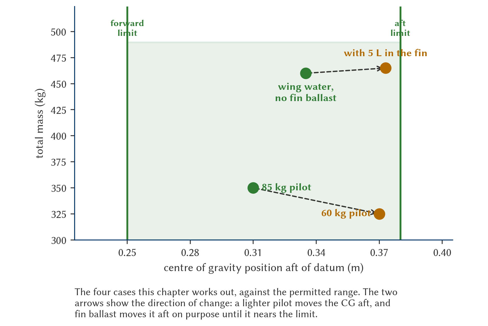

# Mass and balance

> Mass and balance are the foundations of safety on every flight. The numbers you write down in the hangar have very real physical consequences: they decide whether the glider fits you like a glove or turns into an unpredictable machine.
>
>
> In this chapter you will learn:
>
>
> * **The centre of gravity and stability**: why an aft CG can make a spin unrecoverable, and what price you pay for a forward CG.
> * **The mass and balance calculation**: the reference line (**datum**), the arm and the moment, with a numerical example worked out step by step.
> * **Managing the MTOM**: what happens to the glider when you overload it.
> * **Water ballast and fin ballast**: when they help you and how to manage them safely.

## Centre of gravity (CG) and stability

The centre of gravity is the point where the whole weight of the glider is concentrated. Longitudinal stability depends on its position relative to the centre of pressure: where the CG lies decides how the aircraft responds to the stick.

### The danger of an aft CG

Having the CG close to the aft limit is the most critical condition in a glider. The aircraft becomes very sensitive to the elevator and tends to raise its nose by itself, forcing you to fly with the trim set forward. The real problem, however, shows up at the stall: with an excessively aft CG the glider can enter a flat spin, or the elevator may lack the authority to lower the nose and regain speed. In the worst case, the spin cannot be recovered.

How do you end up there? Almost always in one of three ways: flying below the minimum front-seat weight (light pilots), forgetting to remove the tail dolly, or fitting heavy equipment in the tail without compensating for it.

::: {.callout-tip title="Golden rule"}
If you are light, use lead ballast or fixed weights. Never take off without checking that your weight falls within the permitted range for the seat you occupy.
:::

::: {.callout-note title="Airmanship"}
Cockpit ballast must always be mechanically secured in the mountings the manufacturer fits in the nose (lead plates or approved weights with their fixings). Never improvise with sandbags, rucksacks or loose objects: in turbulence or during the take-off rotation they can shift, jam the rudder pedals or change the balance at the worst possible moment.
:::

### Forward CG: stability at the cost of performance

Flying nose-heavy is safer than flying tail-heavy, but it comes at a price. The glider becomes so stable that it insists on keeping its nose down, and you will have to hold the stick back to keep the flight attitude. To stop the nose dropping, the elevator flies deflected upwards, and that deflection adds drag (*trim drag*) that worsens your glide ratio. There is a third, less intuitive effect: since the tail pushes down, the wing has to produce more lift for the same weight, so the effective stall speed rises. @fig-07-cap01-limites-cg summarises these effects of the CG position on longitudinal stability.

## Mass and balance calculation

Knowing that an aft CG is dangerous is not enough. Before take-off you must know where the CG is, and the calculation comes down to three concepts and one formula.

* **Reference line (*Datum*)**: an imaginary vertical plane that the manufacturer defines in the flight manual, usually the leading edge of the wing at the root. All distances are measured from here.
* **Arm**: the horizontal distance from the *datum* to the point where each weight acts. By convention, positive aft and negative forward.
* **Moment**: the product of each weight and its arm. It is the “turning force” that the weight exerts on the whole.

The CG position is the weighted average of all the moments (@fig-07-cap01-datum-momento):

**CG = Σ Moments / Σ Weights**

{#fig-07-cap01-datum-momento}

### Worked example of a loading sheet

Imagine a single-seater whose flight manual gives a permitted CG range of +0.25 m to +0.38 m aft of the *datum* (@tbl-07-cap01-hoja-centrado):

| Item | Weight (kg) | Arm (m) | Moment (kg·m) |
| --- | --- | --- | --- |
| Empty glider (from the weighing record) | 265 | +0.55 | +145.75 |
| Pilot + parachute | 85 | −0.45 | −38.25 |
| **Total** | **350** | — | **+107.50** |
: Example loading sheet for a single-seater {#tbl-07-cap01-hoja-centrado}

The sum of the moments divided by the total mass gives the centre of gravity:

$$
CG = \frac{107.50}{350} = +0.31\ \mathrm{m}
$$

Within the permitted range, with room to spare on both sides.

Now repeat the calculation with a **60 kg** pilot. The pilot's moment changes:

$$
60 \times (-0.45) = -27.00\ \mathrm{kg}\cdot\mathrm{m}
$$

And with it, the total and the result:

$$
CG = \frac{145.75 - 27.00}{265 + 60} = \frac{118.75}{325} = +0.37\ \mathrm{m}
$$

One centimetre from the aft limit. That pilot needs ballast in the nose before take-off.

The lesson lies in the direction of the change: **the lighter the pilot, the further aft the CG moves**, because the seat is forward of the *datum* and its moment is the one pulling the whole towards the front.

With the four cases this chapter works out plotted against the permitted range (@fig-07-cap01-envolvente-centrado), you can see at a glance what the individual figures do not show: which way the CG moves in each situation, and how much margin is left before the limit.

{#fig-07-cap01-envolvente-centrado width="100%"}

The starting weights and arms come from the glider's official **weighing record**, which is updated after every weighing or major repair. The weighing procedure and the associated documentation are covered in **Book 8 — Aircraft General Knowledge, Airframe and Systems and Emergency Equipment**, chapter 4.

## Managing mass: MTOM and overloading

The maximum take-off mass (MTOM) is not a suggestion: it is a structural limit. A heavy glider needs a longer take-off run and a higher towing speed, typically 10–20 km/h more. It will fly faster in the cruise, yes, but its climb rate in thermals suffers. And above the MTOM the margins disappear: the glider suffers more in strong turbulence and the load factor limits are reached much sooner, with the resulting risk of fatigue or structural failure.

{#fig-07-cap01-limites-cg width="70%"}

## Water ballast: performance at the cost of discipline

Water lets you “cheat” the polar, but it demands flawless management. By increasing the wing loading, the glider reaches much higher cruising speeds at the same glide angle, which makes it the ideal weapon for days with strong thermals. The downside is that the climb rate gets worse: if thermals drop below 1.5 m/s, the extra weight sinks you before you can climb.

And one obligation that allows no carelessness: dump the water before landing. The extra weight on touchdown can seriously damage the undercarriage and the fuselage. Dumping takes between 3 and 8 minutes depending on the glider, so plan it before you join the circuit.

### Fin ballast: the clever counterweight

Many modern gliders carry a small water tank in the fin: the fin ballast (*tail tank*). Its purpose is not to add weight but to reposition the CG. The main wing tanks usually sit slightly forward of the centre of gravity, so filling them moves the CG forward and brings in trim drag. A few litres in the tail return the CG to its optimum position, close to the aft limit, where drag is lowest.

Two non-negotiable rules when using it:

* Work out the proportion from the flight manual: each type specifies how many litres in the tail go with each wing fill and each pilot weight.
* Always dump it together with the wings, or before them. Landing with water only in the tail means flying with an extreme aft CG, exactly the unrecoverable-spin condition you saw at the start of the chapter. Check on the checklist that the tail tank drains properly.

::: {.callout-warning title="Safety"}
Never land with the water tanks full unless it is an absolute emergency. The impact energy rises sharply with weight, and you could damage the glider beyond repair.
:::

## Worked exercises

Here are a mass and balance exercise and a final glide exercise, worked out step by step. Try them yourself before reading the solution.

::: {.ejercicio}
**Exercise 1 — Balance with fin ballast.**

A single-seater has a permitted CG range of +0.25 m to +0.38 m. With the wings full of water, the loading sheet reads: glider + wing water = 380 kg with an arm of +0.50 m; pilot + parachute = 80 kg with an arm of −0.45 m. The manual allows up to 5 litres (5 kg) of fin ballast with an arm of +3.90 m. Where is the CG without fin ballast? And how far do the 5 litres move it?

**Solution.** Each weight contributes its moment, which is weight times arm. The glider with the wing water:

$$
380 \times (+0.50) = +190.0\ \mathrm{kg}\cdot\mathrm{m}
$$

And the pilot, with a negative arm because the pilot sits forward of the *datum*:

$$
80 \times (-0.45) = -36.0\ \mathrm{kg}\cdot\mathrm{m}
$$

**Without fin ballast.** The mass adds up to 460 kg and the moments to +154.0 kg·m:

$$
CG = \frac{154.0}{460} = +0.335\ \mathrm{m}
$$

Within range, but forward of the optimum.

**With the 5 litres.** The ballast adds its own moment, and its arm is huge:

$$
5 \times (+3.90) = +19.5\ \mathrm{kg}\cdot\mathrm{m}
$$

$$
CG = \frac{154.0 + 19.5}{460 + 5} = \frac{173.5}{465} = +0.373\ \mathrm{m}
$$

Five kilos have moved the CG from **+0.335 to +0.373 m**, very close to the aft limit, which is where trim drag is lowest.

Two things to take away. First: a few litres a long way from the *datum* move the CG a lot, which is why they must be dumped with the wings —on their own they would leave the CG out of range aft—. Second: check the result against the range, not against your intuition. One more litre, six instead of five, would give

$$
CG = \frac{177.4}{466} = +0.381\ \mathrm{m}
$$

**outside** the aft limit by less than a millimetre. The manual says up to five for a reason.
:::

::: {.ejercicio}
**Exercise 2 — Final glide with wind.**

You are 1,200 m above the ground, 18 km from the aerodrome. Your glider has a glide ratio of 30 in still air, but there is a 20 km/h headwind and you fly the glide at 100 km/h. Do you arrive with the 300 m safety height?

**Solution.** With a headwind, the glide ratio over the ground drops in the same proportion as your actual forward speed.

**Step 1 — ground speed.**

$$
GS = 100 - 20 = 80\ \mathrm{km/h}
$$

**Step 2 — effective glide ratio.** It is the nominal one, corrected by that proportion:

$$
(L/D)_{effective} = 30 \times \frac{80}{100} = 24
$$

**Step 3 — height the leg requires.** With a glide ratio of 24, each kilometre costs one twenty-fourth of a kilometre of height:

$$
h = \frac{18}{24} = 0.75\ \mathrm{km} = 750\ \mathrm{m}
$$

**Step 4 — margin.** You started from 1,200 m:

$$
\text{1,200} - 750 = 450\ \mathrm{m}
$$

Above the 300 m safety height: **you arrive, with 150 m to spare.**

**What if the wind picks up to 40 km/h?** Rework the chain with the new ground speed:

$$
(L/D)_{effective} = 30 \times \frac{60}{100} = 18
$$

$$
h = \frac{18}{18} = 1\ \mathrm{km} = \text{1,000}\ \mathrm{m}
$$

You would arrive with just 200 m. Time to climb one more thermal before committing to the final glide: the margin has lost two thirds without you doing anything.

It is the same calculation that **Book 9 — Navigation**, chapter 5, presents as the glide cone. There it is written as reachable distance:

$$
D = h \cdot (L/D) \cdot \frac{GS}{TAS}
$$

and here as required height. They are the same formula rearranged in two ways, and it pays to handle both: this one answers “do I have height to spare?” and that one, “what is within reach?”.
:::

::: {.postit}
**Chapter summary: mass and balance**

* **Aft CG**: the most dangerous condition. The aircraft becomes unstable (it wants to raise its nose by itself) and recovery from a stall or spin may be impossible. If you are light, use mechanically secured ballast, never improvised ballast.
* **Forward CG**: the aircraft is very stable (nose-heavy), but less efficient because of the drag of the deflected elevator, and with a higher stall speed.
* **CG calculation**: CG = Σ Moments / Σ Weights. Each weight is multiplied by its arm (distance from the *datum*) and the sum of the moments is divided by the total mass. The starting data come from the official weighing record.
* **Maximum mass (MTOM)**: an overloaded glider needs more runway to take off, has a higher stall speed and suffers more structural fatigue at lower g.
* **Water ballast**: lets you fly faster at the same glide angle (ideal for strong days), but worsens the climb rate in thermals. And remember: the water is dumped before landing.
* **Fin ballast**: adds no performance by itself; it repositions the CG when you fill the wings. Always dump it together with the main tanks: water only in the tail amounts to an extreme aft CG.
:::
