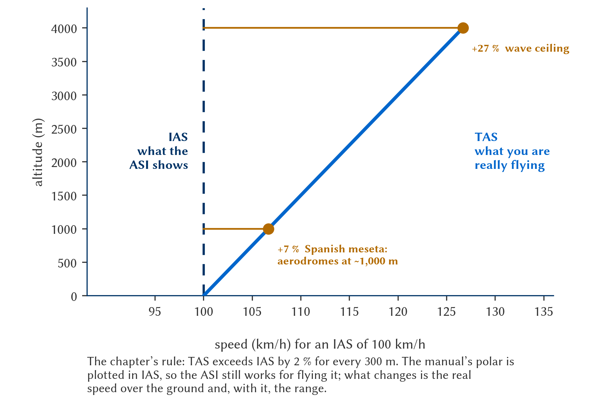

# Speed polar of sailplanes or cruising speed

> Understanding your glider's polar is like knowing an engine's power map by heart. In gliding, gravity is our fuel and aerodynamics our throttle. The polar tells you exactly how much height you pay for every kilometre per hour of speed you gain.
>
>
> In this chapter you will learn:
>
>
> * **The polar curve**: the two speeds you must know by heart (minimum sink and best glide).
> * **MacCready theory**: how to match your cruising speed to the strength of the day.
> * **The effect of weight**: how water ballast shifts the polar without changing the best glide ratio.
> * **The effect of wind and sinking air**: when to speed up and when to hold back.
> * **IAS and TAS at altitude**: why the airspeed indicator “lies” to you at high aerodromes and in wave flying.
> * **The final glide**: energy management with a safety margin.

## The polar: your performance curve

The polar curve plots rate of sink against airspeed. It is your glider's DNA: every type has its own, and from it come the two speeds that matter (@fig-07-cap02-polar-anotada).

* **Minimum sink speed**: the highest point of the curve. At this speed you lose the fewest metres per second; it is the ideal speed for staying airborne while you wait for a thermal.
* **Best glide speed (L/D)**: the point where the tangent from the origin touches the curve. At this speed you cover the greatest possible distance for every metre of height lost; it is your gliding speed in still air.

{#fig-07-cap02-polar-anotada}

::: {.callout-note title="Airmanship"}
Learn these two values by heart for your glider type. In still air there is no reason to fly at intermediate speeds if what you want is to go far or to stay up.
:::

## The effect of weight: the polar shifts

Remember the water ballast from the previous chapter? Here is the graphical explanation of why it works. As the weight (wing loading) increases, the whole polar curve shifts to the right and downwards, sliding along the tangent from the origin (@fig-07-cap02-polar-peso). There are three consequences:

* **The best glide ratio (L/D) does not change**: the tangent from the origin touches the new curve with the same slope. A glider with a glide ratio of 40 still has a glide ratio of 40 when full of water.
* **That glide is reached at a higher speed**: if your best glide was at 95 km/h empty, with ballast it may be at 110 km/h. You cover the same kilometres per metre of height, but faster. That is why water wins races on strong days.
* **Minimum sink gets worse**: the top of the curve drops. In weak thermals the loaded glider climbs worse, or not at all. It is the other side of the coin: ballast is a loan you repay in every weak thermal.

{#fig-07-cap02-polar-peso}

## MacCready theory: matching speed to the day

Paul MacCready revolutionised gliding with a simple idea: the speed between thermals should depend on how strong you expect the next one to be.

* **Strong day, fly fast**: if you expect to climb at 3 m/s, you do not mind losing height quickly to reach the next cloud sooner. The time gained makes up for the height lost.
* **Weak day, fly slowly**: if the next thermal is weak, hold on to your height. If you climb slowly, cruise slowly.
* **The MacCready ring**: the dial around the variometer. Set the triangle to the expected climb and the ring shows you the speed that optimises your average cross-country speed.

## The effect of wind and sinking air

The polar in the flight manual is drawn for still air. In the real world the air mass moves, and the optimum speed moves with it (@fig-07-cap02-polar-viento).

* **Headwind**: your glide cone shrinks and you need to penetrate. Fly faster than best glide speed; a rule of thumb is to add half the wind speed to it.
* **Tailwind**: a gift from nature. Fly at best glide speed, or a little slower, and let the wind push you.
* **Sinking air (sink)**: speed up. The sooner you get out of the area that is pushing you down, the less total height you lose.

{#fig-07-cap02-polar-viento}

## IAS and TAS: when the airspeed indicator “lies”

The polar in the flight manual is drawn in indicated airspeed (**IAS**), which is what your airspeed indicator shows. But the airspeed indicator measures dynamic pressure, not real speed: as you climb and the air becomes less dense, your true airspeed (**TAS**) becomes increasingly higher than the indicated one. The rule of thumb: TAS exceeds IAS by 2 % for every 300 m of altitude.

Why does this matter to you in Spain? Because many of the gliding aerodromes on the meseta sit at around 1,000 m elevation, and in thermal or wave flying you will routinely operate between 2,000 and 4,000 m:

* **The polar speeds are flown in IAS**: best glide and minimum sink occur at the same IAS as always; you do not need to correct anything on the airspeed indicator to glide well.
* **But you cover more ground than you think**: at 3,000 m, an IAS of 100 km/h is about 120 km/h TAS. Your final glide covers more kilometres per minute, and your drift in wind is also greater than the instrument suggests.
* **On the approach to a high aerodrome, your senses deceive you**: at the correct approach IAS the ground goes by faster than usual and the landing run will be longer. Do not “slow down” the aircraft below the indicated speed in the manual: the stall occurs at the same IAS as always.

@fig-07-cap02-ias-tas-altitud puts figures on that gap: taking off from an aerodrome on the meseta you are already flying 7 % faster than the instrument shows, and at the top of a wave, 27 %.

{#fig-07-cap02-ias-tas-altitud width="100%"}

::: {.callout-important title="Regulation"}
Your glider's speed limitations (V~NE~ (never exceed speed), V~A~ (manoeuvring speed) in turbulent air) appear in the **approved flight manual (AFM)** and derive from the European certification specification **CS-22** for sailplanes. Take care when flying high: **flutter** depends on TAS, so the **indicated** V~NE~ decreases with altitude. This reduction is prescribed by **CS 22.1505**, which requires the table to be shown on a placard visible in the cockpit. The AFM includes a table of V~NE~ against altitude —for example, a glider with a V~NE~ of 250 km/h at sea level may be limited to about 200 km/h indicated at 6,000 m—. Check it before any wave flight.
:::

## Final glide and safety

The final glide is the leg from the last thermal to the aerodrome: an exercise in energy management where the margin for error tends to zero.

* **Final glide computer**: mechanical or digital, always set it with a safety margin.
* **Safety height**: never plan to reach the aerodrome with zero metres. Set an arrival height (300 m, for example) and treat it as sacred: it is for flying the landing circuit, not for stretching the glide.
* **The glide cone**: picture an inverted cone reaching down from your glider to the ground. Whatever lies outside that circle is out of reach. With a headwind, the circle becomes a displaced ellipse; always keep it in mind.

::: {.callout-warning title="Safety"}
If your final glide computer says you will “just” make it, in reality **you will not**. The computer does not know whether you will meet unexpected sink or whether the headwind will be stronger lower down. Look for an alternative before the glide cone closes.
:::

::: {.postit}
**Chapter summary: speed polar and MacCready**

* **The polar**: your performance curve. Know it: it gives you the speed for staying airborne longest (minimum sink) and the speed for going furthest (best glide).
* **Effect of weight**: ballast shifts the polar to the right and down. The best glide ratio does not change, but it is flown at a higher speed; minimum sink gets worse. Water is for strong days.
* **MacCready theory**: match your cruising speed to the thermal you expect. Strong day, fly fast (you trade height for time); weak day, fly slowly and conserve.
* **Effect of wind**: with a headwind, fly faster (add half the wind to your best glide speed) to penetrate better. With a tailwind, fly at best glide and let yourself be pushed.
* **IAS vs TAS**: the polar is flown in IAS, but at altitude TAS is higher (~2 % for every 300 m). You cover more ground than you think, and the indicated V~NE~ decreases with altitude (flutter): check the AFM table before flying in wave.
* **Final glide**: plan your arrival with a margin. Better to arrive at 200 m above the field and use the airbrakes than to skim the treetops praying for a bubble.
:::
