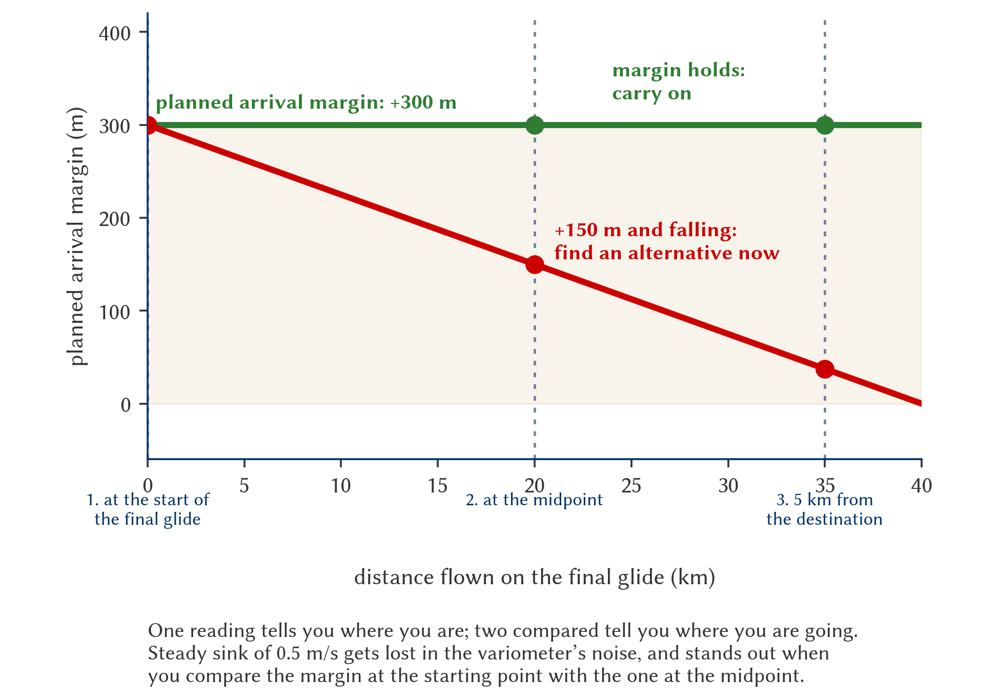

# Flight monitoring and in-flight re-planning

> Once you have taken off and your task is under way, the flight plan stops being a static sheet and becomes a living process of monitoring. The atmosphere changes, and the pilot who does not adapt the strategy in flight is the one who ends up landing in a field too early.
>
>
> In this chapter you will learn:
>
>
> * **The glide cone**: your safety bubble and how the wind distorts it.
> * **Mental arithmetic in the cockpit**: quick rules for range and drift without relying on the GPS.
> * **Monitoring the final glide at 3 points**: how to detect steady sink before it is too late.
> * **The point of no return (PNR)** and the change of mindset that crossing it involves.
> * **The human factor**: how hypoxia and dehydration degrade exactly the abilities that re-planning needs.

## The glide cone: your safety bubble

Imagine an inverted cone reaching down from your glider to the ground. Everything inside that circle is reachable terrain if you do not find a single thermal more (@fig-07-cap05-cono-alcance).

* **The shape of the cone**: in still air it is a perfect circle. With a strong headwind it is distorted into an ellipse that shrinks ahead and stretches behind.
* **The decision horizon**: do not wait until your destination is on the edge of the cone. If the goal is beyond your visual or instrument reach, it is time to re-plan.

{#fig-07-cap05-cono-alcance}

## Mental arithmetic: quick rules in the cockpit

Under stress you will not always be able to trust the flight computer. You have to be able to estimate in your head:

* **From km/h to metres per second**: divide by 3.6. At 100 km/h you cover about 28 metres per second; in a minute, almost 1.7 km.
* **Range from 1,000 m**: as a conservative approximation, with glide ratios of 20 to 30 (those of a training or Standard Class glider), at a height of 1,000 m you have a range of 20 to 30 km in still air. With a headwind, halve that range to be safe.
* **Margin for the circuit**: always add 300 metres to your calculation. If the aerodrome is 20 km away and your glider glides at 1:30, you need about 670 metres of pure glide; with the 300 m safety margin, the sum comes to a round 1,000 metres.

::: {.callout-tip title="Golden rule"}
**The thermal is your windsock.** While you circle, your circles drift with the wind: the direction and distance you are carried on each turn tell you where the wind is coming from and how strong it is, without looking at any instrument. To correct for drift in straight glide: at 100 km/h, every **10 km/h of crosswind ≈ 6° of correction** into the wind. With 20 km/h of crosswind, aim about 12° to the windward side and check against a distant ground reference that your track over the ground holds.
:::

## Monitoring the final glide: the 3-point method

Working out the final glide once and flying it on blind faith is betting the task —and the glider— on the air mass not changing. The professional method checks the margin at three points:

1. **At the start of the final glide**: note your planned arrival height (for example, arrival calculated at +300 m above the field).
2. **At the midpoint of the leg**: recalculate. If the margin holds at around +300 m, the air mass is behaving as you expected. If it has dropped to +150 m and is still falling, you are flying through sink or more headwind than forecast. Speed up the decision, not the glider: look for your alternative now.
3. **About 5 km from the destination**: final check, with a real margin for joining the circuit. At this distance the result is no longer an estimate: it is reality.

The strength of the method lies in the trend: one reading tells you where you are; two readings compared tell you where you are going. Steady sink of 0.5 m/s gets lost in the variometer's noise, but it stands out when you compare the margin at the starting point with the one at the midpoint (@fig-07-cap05-metodo-tres-puntos).

{#fig-07-cap05-metodo-tres-puntos width="100%"}

* **Safety box**: throughout the final glide, keep at least one alternate aerodrome or known field inside the glide cone with a minimum arrival height of 300 m AGL. The day the midpoint margin collapses, you will be glad to have the alternative already chosen.

## Point of no return (PNR)

The PNR is the moment in the flight when you no longer have the height to return to the departure aerodrome or to the last safe area you left behind.

* **Recognition**: be aware of the exact moment you cross that invisible line. From then on there is only one way: forward, towards the next safe point (alternate aerodrome or selected field).
* **Change of mindset**: once past the PNR, your number one priority is no longer the task but constantly locating landable fields.

::: {.callout-note title="Airmanship"}
Calling out loud (or to yourself) “I have crossed the PNR” helps you mentally to stop looking at the task on the GPS and start looking seriously at the ground.
:::

## Safety height and re-planning

The safety height is not negotiable: it is the margin that absorbs a miscalculation or unexpected sink as you arrive at the field.

* **The circuit rule**: set a height (300 m, for example) at which, if you have not found a thermal, you give up the search and join the circuit of the chosen aerodrome or field.
* **Re-plan in time**: if the planned route is blocked by shade, rain or airspace, do not wait until you are low to decide. Divert early: better to fly 10 km more with height than 5 km direct into the ground.

## The human factor: your calculator degrades too

Everything above —mental rules, the 3-point method, the PNR decision— depends on a single instrument: your brain. And that instrument loses precision just when you need it most:

* **Hypoxia**: on wave flights above 3,000 m without supplementary oxygen, mental arithmetic and judgement degrade insidiously: the first symptom is, precisely, not noticing the symptoms. A final glide calculated with incipient hypoxia is a miscalculated final glide.
* **Dehydration and fatigue**: after 4 or 5 hours of task under the canopy, dehydration slows decisions and encourages fixation: carrying on towards the goal “because that was the plan” instead of re-planning. Delay in accepting an outlanding is exactly the error this chapter tries to prevent.

The physiological mechanisms, the Time of Useful Consciousness and the use of oxygen are covered in **Book 2 — Human Performance**, chapter 4. Here, keep the operational rule: drink on a schedule (not when you are thirsty), use oxygen as the manual says on high flights and, if you have been on task for many hours, distrust your own estimates and add margin to every calculation.

::: {.callout-warning title="Safety"}
If your flight computer shows you arriving with 0 metres, **you will not make it**. That calculation is theoretical: in the real world the air is almost never completely still. Always carry a cushion of height and do not let it be used up.
:::

::: {.postit}
**Chapter summary: monitoring and re-planning**

* **Glide cone**: picture the cone under the glider; whatever lies outside it is out of reach. Always have a safe landing option inside the cone.
* **Mental arithmetic**: 1 km of height gives 20–30 km of range, depending on the wind and the aircraft; with a strong headwind, halve it. For drift: at 100 km/h, every 10 km/h of crosswind needs about 6° of correction.
* **Final glide at 3 points**: check the arrival margin at the start, at the midpoint and 5 km from the destination. The trend between readings gives away steady sink or unforecast wind in time.
* **Point of no return**: there comes a moment when you will no longer get home. Have it identified. From then on, your goal is the next safe aerodrome or field.
* **Human factor**: hypoxia, dehydration and fatigue degrade mental arithmetic and delay the decision to land out. Drink on a schedule, use oxygen on high flights and add margin when you have been on task for hours (details in **Book 2 — Human Performance**, chapter 4).
* **Safety height**: set an untouchable margin for arriving at the field (300 m, for example). That height is for the circuit, not for gliding. If the computer says you arrive with 0 m, you will not make it.
:::
