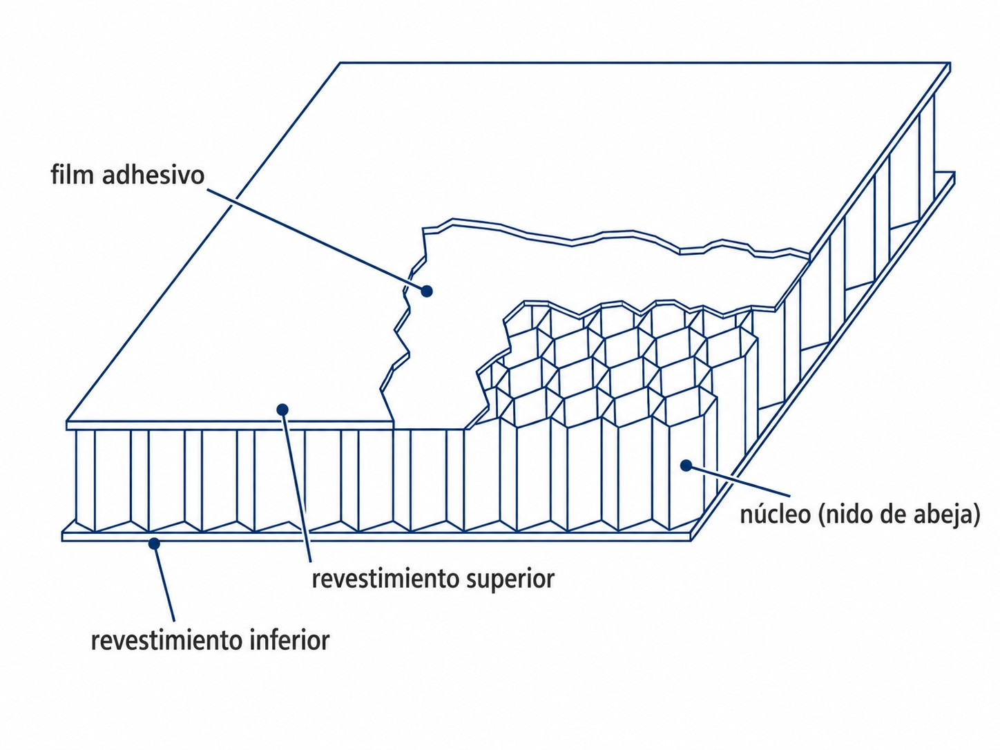
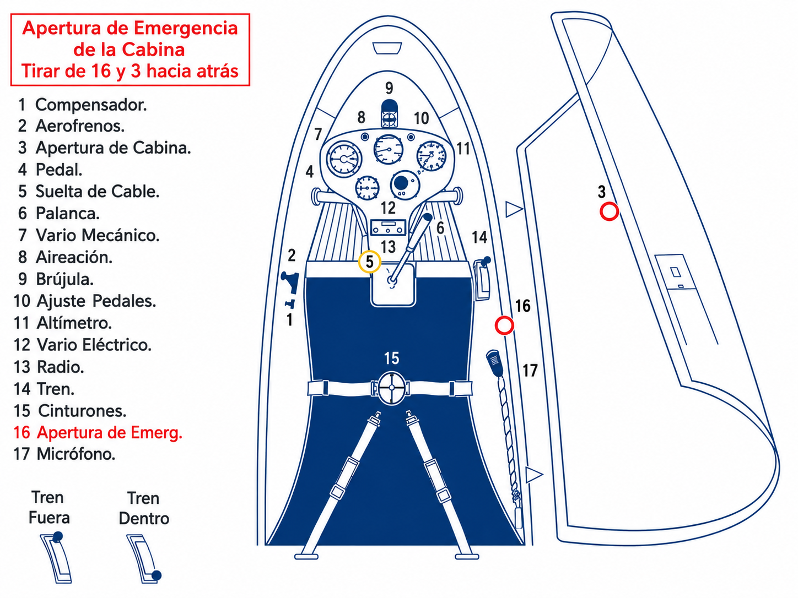
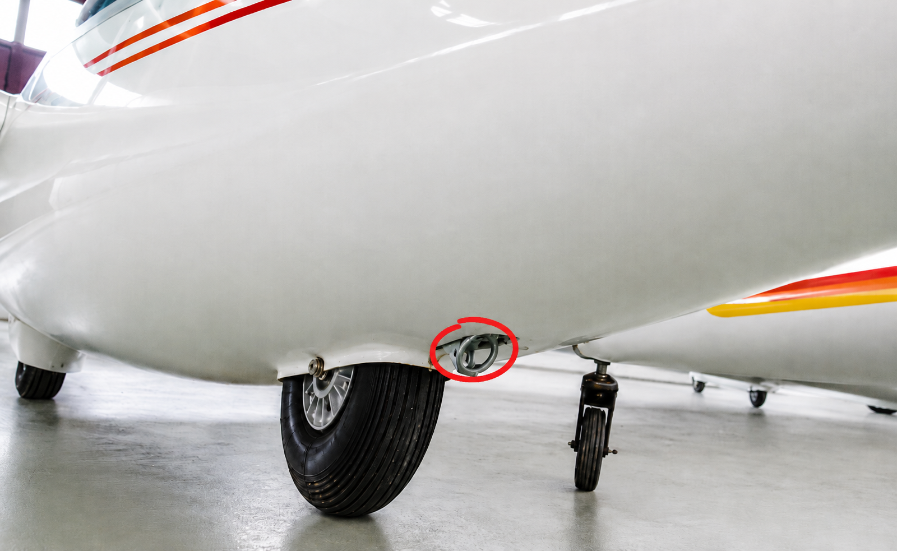

# Airframe

> The airframe is the first thing you inspect every morning and the last thing that should fail you in flight. Knowing what your sailplane is made of, and how each material reacts to sun, damp or a knock, is the basis of every pre-flight inspection.
>
>
> In this chapter you will learn:
>
>
> * **Construction materials**: composite (glass and carbon fibre), wood and fabric, and metal, with the weak points of each.
> * **Gelcoat and polyurethane**: why sailplanes are white, and why each finish needs its own products and care.
> * **The spar and sandwich construction**: where the strength of the wing lies, and why a small knock can hide a delamination.
> * **The canopy**: locking, ventilation and emergency exit.
> * **The towhook**: nose hook, CG hook and the automatic release mechanism.

Sailplane design aims to cut drag and empty mass at the same time. There is no engine to make up for losses in the glide, so the surface finish matters a great deal: a badly finished repair, dirt or insects on the leading edge all cost performance.

## Construction materials

Materials have changed over the decades, from the ash and spruce of the pioneers to the carbon fibre of today's competition sailplanes.

### Composite materials

The great majority of modern sailplanes are built from composite materials, above all glass-reinforced plastic (*GRP*) and carbon-reinforced plastic (*CRP*).

* **Glass fibre**: the industry standard since the late 1950s. Good strength for its weight, and it can be moulded into very smooth surfaces.
* **Carbon fibre**: more modern and more expensive. It allows very stiff, strong parts with little mass, although the result depends on how the fibres are oriented and how the laminate is built. What it mainly adds over glass fibre is stiffness, so it goes into the most heavily loaded areas and into high-performance sailplanes.

::: {.callout-note title="Airmanship"}
Composite sailplanes are almost always white for a technical reason, not an aesthetic one: the epoxy resin that binds the fibres loses mechanical properties if it gets too hot. White reflects solar radiation and keeps the structure within its temperature limits.
:::

### Wood, fabric and metal

They are less common on today's airfields, but a few classics are still flying:

* **Wood and fabric**: wooden structures (such as the Schleicher K8) covered in aircraft fabric. Damp can deteriorate the wood and its joints; sun, tension and rubbing age the fabric. During the inspection, look for stains, distortion, open seams, tears or slack areas. If something does not look as it normally does, do not press on it or try to repair it: have it checked by competent staff.
* **Metal (aluminium)**: rare in pure sailplanes; the best-known example is the Let L-13 Blaník. Its construction resembles that of a conventional aeroplane, with spars, ribs and riveted aluminium panels. The concerns here are corrosion, cracks around joints and rivets, and dents or wrinkles that give away a distortion. A new crack or distortion keeps the sailplane on the ground until it has been assessed.

## Gelcoat: the sailplane's skin

**Gelcoat** is a layer of polyester resin that covers many fibre structures. It gives the characteristic smooth, glossy finish and helps protect the laminate from damp and the environment.

Ultraviolet radiation and sudden changes in temperature age it. Over the years “crazing” can appear, a network of fine cracks in the surface.

Some modern sailplanes use acrylic **polyurethane** (PU) paint systems instead of polyester gelcoat. These are different finishes, and they are not repaired or polished in the same way. Do not try to tell them apart by their shine alone: check the maintenance manual before using a cleaner, wax or polish.

::: {.callout-tip title="Golden rule"}
Protect the surface from the sun with covers and clean it without rubbing it dry. To wax or polish, use only products and methods accepted by the manufacturer: what works on gelcoat can ruin a polyurethane paint.
:::

## The spar and sandwich construction

If the sailplane were a body, the **spar** would be the backbone of the wing. It is the wing's main load-bearing member and carries a large part of the bending loads; the skin and other members also carry load, depending on the design. If the spar is damaged, or you suspect it is, the sailplane is out of service until competent staff have assessed it and decided whether an approved repair is possible.

Many areas of the wing and fuselage use **sandwich construction**: two thin, stiff layers of fibre (the “skins”) with a light core of rigid foam or honeycomb between them.

This gives large surfaces with enormous stiffness and minimal weight. The price is fragility against point impacts: a knock against the edge of a hangar door can delaminate the inside while leaving hardly a mark outside.

{#fig-08-cap01-estructura-ala width="50%" fig-alt="Cross-section of a sandwich panel. An upper and a lower skin are separated by a honeycomb core and bonded to it with an adhesive film."}

## The canopy

The Perspex canopy is, together with your eyes, your main defence against collision: you watch for traffic through it for the whole flight. It is also part of the emergency exit, so it deserves a careful check before take-off.

* **Locking**: the side (or front) catches must be locked and checked before take-off. If the canopy opens during the launch, the noise and the airflow can startle the pilot at a stage with little room to react.
* **Ventilation**: the side window (clear-view panel) and the cockpit air vent are there to ventilate and demist. In winter, misting can hide the traffic and the runway right in the middle of the launch.
* **Emergency exit**: each type has its own procedure. Depending on the design, it may mean opening the canopy, jettisoning it, or operating two handles in a set order. Find the handles on the ground and learn the AFM sequence with your instructor; colour or position is not enough to guess it.
* **Caring for the Perspex**: use plenty of water or an approved product and a clean, soft cloth, without rubbing it dry. Do not use solvents or household cleaners unless the manufacturer allows them.

The illustration below shows one particular configuration. The numbers 16 and 3 belong to this drawing only: **they are not a valid sequence for every sailplane**. In the aircraft you are going to fly, the AFM and the markings on its own handles are what count.

{#fig-08-cap01-8-1-2-1-cabina-de-un-planeador fig-alt="Drawing of a cockpit with numbered controls. A warning highlights handles 16 and 3 as part of one particular emergency opening configuration, not as a general procedure."}

## The towhook

The release hook is the point where the sailplane is attached to the winch cable or the tow rope. What it is used for depends on the approved installation and the AFM, not just on where it is fitted. In the most common Tost configuration you will find these two types:

* **Nose hook**: usually a Tost E 85 fitted in the nose and intended for aerotow. It has no automatic release.
* **CG hook**: usually a Tost G 88 fitted under the fuselage, near the centre of gravity, and intended for winch launching.

The hook used for the winch must have an automatic release (*back-release*), as CS 22.711 and CS 22.713 require. If the sailplane overflies the winch with load still on the cable, the mechanism lets the cable go even if the pilot does not pull the release knob.

Many training sailplanes have both. The usual arrangement is nose for aerotow and CG for winch. The rule that matters, though, is this one: **use the hook that the AFM and the sailplane's placards authorise for that launch method**. Some types allow aerotow from a hook close to the CG; on those, follow the specific procedure in the manual.

{#fig-08-cap01-planeador width="50%" fig-alt="View from below of a sailplane next to the main wheel. A red circle marks the towhook under the fuselage."}

::: {.callout-warning title="Safety"}
For a winch launch, use only the hook that the AFM authorises and that has an automatic release (**back-release**). A standard Tost E 85 nose hook does not have one and cannot be used for the winch. Do not try to work out compatibility from the position or appearance of the hook: check the manual and the placards before the cable is attached.
:::

::: {.callout-warning title="Safety"}
The towhook wears and has its own inspections. Keep track of its limits in time and number of operations according to the maintenance programme and the manufacturer's instructions. In the pre-flight inspection, test the release with the intended tool or cable and check that the mechanism opens and closes cleanly, without sticking.
:::

::: {.postit}
**Chapter summary: airframe**

* **Materials**: composites dominate in modern sailplanes. In wood and fabric, look for damp, distortion and damage to the covering; in metal, for corrosion, cracks and new dents.
* **Gelcoat and paint**: they protect and smooth the surface, but are not cared for in the same way. Use covers, clean gently and check the manual before waxing, polishing or repairing.
* **Spar**: the main load-bearing member of the wing, although it does not work alone. If you suspect it is damaged, the sailplane is out of service until competent staff have assessed it.
* **Sandwich construction**: two hard layers with a light core (foam or honeycomb). Very stiff and light, but delicate against point impacts.
* **Canopy**: catches locked before take-off, emergency handles located and the AFM procedure learnt on the ground. Clean the Perspex with products the manufacturer accepts.
* **Towhook**: use the one the AFM and placards authorise for each method. The hook used for the winch must have an automatic release (**back-release**). Check that it works in the pre-flight inspection.
:::
