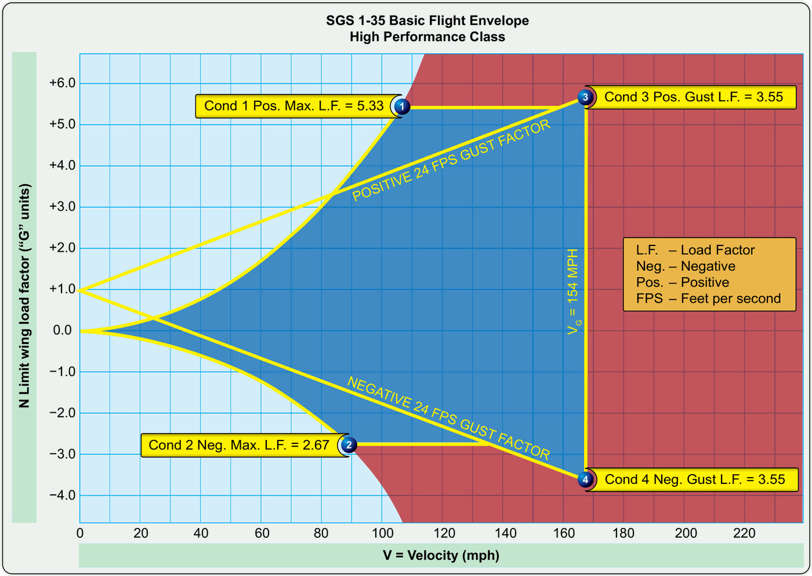

# System design, loads and stresses

> Your sailplane is strong, but not invincible. Certification sets out precisely how much load the structure can take and where the limits lie that you must never explore.
>
>
> In this chapter you will learn:
>
>
> * **The load factor (n)**: what “pulling g” means and how turns and pull-outs produce it.
> * **The design categories** Utility and Aerobatic under CS-22, and their g limits.
> * **Limit load and ultimate load**: what the 1.5 factor of safety protects and what it does not.
> * **Structural fatigue** in composites and the life-extension inspections.
> * **Flutter**: the vibration that can tear a sailplane apart in seconds.

A sailplane has to be more than aerodynamically efficient. It also has to withstand the forces of the atmosphere and the pilot's manoeuvres. That structural design is governed by strict standards (such as CS-22 of EASA, the European Union Aviation Safety Agency), which set how much load the aircraft must carry before it suffers damage.

## The load factor (n)

The **load factor** (in “g”) is the ratio between the total lift the wings produce and the weight of the sailplane. In straight and level flight it is 1g: the wings support exactly the weight of the aircraft. In a steep turn, or when you pull back on the stick to recover from a dive, the value rises and the structure works much harder.

In a turn, the load factor grows with the angle of bank, because the wings have to produce more lift to support the weight while they curve the flight path. The relationship is not linear:

| Angle of bank | 0° | 30° | 45° | 60° |
| --- | --- | --- | --- | --- |
| Load factor | 1g | 1.15g | 1.41g | 2g |
: Load factor as a function of angle of bank in a turn

At 60° of bank the sailplane “weighs” twice as much: a 500 kg sailplane puts 1,000 kg on its wings. That is why a very steep turn, above all at low speed, brings you dangerously close to the stall.

## Design categories

Not all sailplanes are designed for the same loads. The European rules distinguish two main categories:

* **Utility category (U)**: for normal flying, thermalling and cross-country. Certified to withstand +5.3g and −2.65g at the manoeuvring speed. These limits narrow as speed increases, down to +4.0g and −1.5g at the design diving speed (V~D~); the full envelope (the V-n diagram) is covered in **Book 5 — Principles of Flight**, chapter 5.
* **Aerobatic category (A)**: for extreme manoeuvres, with limits of +7g and −5g.

::: {.callout-important title="Regulation"}
**CS 22.337 (limit manoeuvring load factors)**: the Utility category must withstand +5.3 / −2.65 (at the manoeuvring speed) and the Aerobatic category +7.0 / −5.0. **CS 22.303 (factor of safety)**: unless otherwise specified, a factor of safety of 1.5 is applied to the limit loads to obtain the ultimate loads.

The actual limits for your aircraft are in its Flight Manual. Check them before flying a new type.
:::

## Limit load and ultimate load

Certification works with two key concepts:

1. **Limit load**: the maximum load the sailplane can take without permanent deformation. Once it has been reached, the structure must return to its original shape without damage.
2. **Ultimate load**: the value at which the structure fails catastrophically. As a general rule a factor of safety of 1.5 applies, so a sailplane with a limit load of 5.3g would have a theoretical ultimate load of about 8.0g.

::: {.callout-warning title="Safety"}
Never use the factor of safety as a “manoeuvring margin”. That 1.5 is there to cover imperfections in the material or unexpected atmospheric conditions, not so that the pilot can fly outside the limits.
:::

## Fatigue and service life

Glass and carbon fibre last well, but not for ever. Years of flying, repeated stresses and landings eventually produce fine cracks or delamination.

So manufacturers lay down service-life inspection programmes. Composite aircraft commonly undergo in-depth structural inspections at 3,000, 6,000 and 9,000 flying hours to confirm that the structure is still safe.

## Flutter: the deadly vibration

**Flutter** is a self-excited vibration that appears when aerodynamic forces interact uncontrollably with the elasticity of the wing or the control surfaces. It is extremely violent and can tear an aircraft apart in seconds.

It is closely tied to speed. V~NE~ (never-exceed speed) is certified with a safety margin below the speed at which flutter appears. But that margin is not a blank cheque. A sailplane with play in the controls, with mass balances wrongly set after a repair, or with water trapped in the control surfaces can flutter even below V~NE~. That is why control surface balance is checked after any repair or repaint.

{#fig-08-cap02-diagrama-vn}

::: {.postit}
**Chapter summary: loads and design**

* **Load factor (n)**: sailplanes are strong, not invincible. It grows with the angle of bank (2g at 60° of bank). Utility category: +5.3g / −2.65g. Aerobatic category: +7g / −5g (CS 22.337).
* **Fatigue**: glass fibre lasts a very long time, but it is inspected periodically (3,000 h, 6,000 h…) for fine cracks or delamination.
* **Limit and ultimate load**: the limit load is the maximum without permanent deformation; the ultimate load is the one that breaks the structure (1.5 times the limit load, CS 22.303). Stay well away from those values.
* **Flutter**: a deadly self-excited vibration. V~NE~ is set with a margin against flutter, but play or imbalance in the controls can cause it even below that speed. Respecting V~NE~ is respecting your life.
:::
