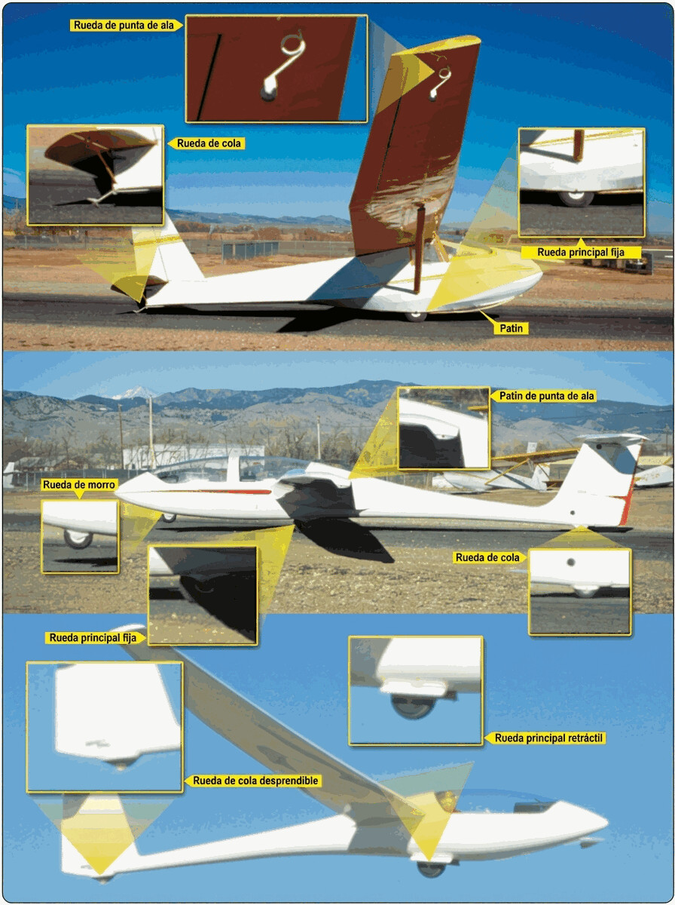

# Landing gear, wheels, tyres and brakes

> Every flight ends on the ground, and the undercarriage is the only thing between the structure (and your spine) and the runway.
>
>
> In this chapter you will learn:
>
>
> * **Undercarriage configurations**: fixed and retractable, and the discipline each one demands.
> * **Shock absorption and “fuse elements”**: how the undercarriage protects the pilot in a heavy landing.
> * **The braking system**: types of brake, how they are operated and their limits.
> * **The tail skid and tailwheel**: the wear points to keep an eye on.
> * **What to do if the undercarriage will not come down**: the mildest emergency in the catalogue, if you handle it well.

The undercarriage is the sailplane's interface with the ground. We spend almost all our time in the air, but a safe landing depends on that system working properly and on the pilot managing it with discipline.

## Undercarriage configurations

Depending on the use and performance of the sailplane, there are two main types:

* **Fixed undercarriage**: common on training sailplanes (such as the ASK-21). Usually a sturdy main wheel, sometimes with a nose wheel and a tailwheel (or skid). Its great advantage is simplicity: there is nothing to forget to lower.
* **Retractable undercarriage**: the standard on performance sailplanes. Hiding the wheel inside the fuselage removes a good part of the drag. The mechanism is usually manual, with a lever on the right-hand side of the cockpit.

::: {.callout-tip title="Golden rule"}
Treat the management of a retractable undercarriage as sacred: it is retracted only after releasing from the launch and reaching a safe height, and it is lowered again on joining the downwind leg, without exception. Make it part of your mental check before landing.
:::

## Suspension and “fuse elements”

Unlike heavy aircraft, many sailplanes have only basic shock absorption: rubber blocks, steel leaf springs or simply the elasticity of the tyre itself.

Even so, the undercarriage does an important safety job: it works as a **fuse element**. In a very heavy landing, the undercarriage mounting is designed to break before the main fuselage structure, absorbing part of the energy of the impact and protecting the pilot's spine.

## Tail skid and tailwheel

At the tail, sailplanes have a skid (on classic types) or a small tailwheel. It protects the fuselage in nose-high landings and while taxiing or being moved on the ground. It is a point of constant wear: in the daily inspection, check the skid shoe or the tailwheel tyre and how firmly it is fixed to the fuselage. Many sailplanes also have small wheels or protective pads on the wingtips for turning on the ground.

## The braking system

The wheel brake is key to stopping the landing run, above all on short runways or in outlandings.

* **Type of brake**: modern types have hydraulic disc brakes, which work very well; older ones have drum brakes.
* **Operation**: on most sailplanes the brake comes on when the airbrake lever is moved to the end of its travel. On others it is on the pedals or on a separate lever.

::: {.callout-warning title="Safety"}
Do not brake harshly at the start of the landing run if you are still fast: you can cause a nose-over (the nose digs into the ground) or flat-spot the tyre through excessive wear.
:::

## Maintenance and emergencies

An under-inflated tyre does not just increase rolling resistance: it can come off the rim in a crosswind landing. Always check the condition of the wheel and that the retraction cables are clean: mud or grass that builds up can jam the mechanism.

And if the undercarriage will not come down? If the lever is stuck, a gentle jolt (a dive followed by a pull-up) sometimes helps gravity force it down. And if you do end up landing with the wheel up, do it on grass: the damage is usually limited to scrapes in the fuselage gelcoat, without putting the pilot at risk.

{#fig-08-cap03-mecanismo-tren}

::: {.postit}
**Chapter summary: undercarriage**

* **Configurations**: fixed undercarriage (training, simple) or retractable (performance). The retractable one is lowered without fail on the downwind leg: wheel down and locked.
* **Shock absorption**: on many sailplanes the only suspension is the tyre and your cushion. The undercarriage acts as a “fuse element”: in a very heavy landing it breaks before the fuselage does.
* **Brakes**: disc (effective, but they can overheat) or drum. They come on at the end of the airbrake travel or with a separate lever. Check that they work before take-off.
* **Tail skid**: protects the fuselage in nose-high landings. A wear point to keep an eye on.
* **Undercarriage will not come down**: try a gentle jolt; if that fails, land on grass with the wheel up. Minor damage, pilot safe.
:::
