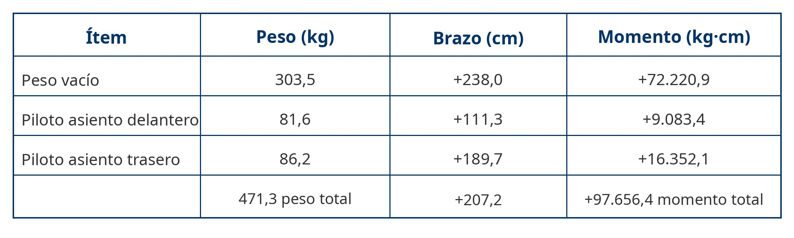

# Mass and balance

> A sailplane that takes off overloaded or out of balance is already carrying its accident on board. This chapter looks at mass and balance from the point of view of the aircraft's systems: where the ballast goes, what the limitations placard says and when the aircraft has to be weighed again.
>
>
> In this chapter you will learn:
>
>
> * **The maximum take-off mass (MTOM)** and how it differs from the maximum mass without water.
> * **Centre of gravity limits**: what happens with a CG too far forward or, worse, too far aft.
> * **Ballast management**: nose weights, tail tank and the limits of the baggage compartment.
> * **Weighing the aircraft**: when it is repeated and where it is recorded.

Flying within the mass and balance limits is not optional: it is a legal and a safety requirement. In a car, the load only affects fuel consumption. In a sailplane it decides whether the aircraft is stable and controllable, or turns into a trap the day you stall.

## Mass and maximum weight

Every sailplane has a defined **maximum take-off mass** (*MTOM*). Exceeding it puts loads on the structure it was not designed for, cuts the safety margin in manoeuvres and worsens the climb.

Keep the maximum total mass apart from the maximum mass without water. The water is carried in the wings, so it does not load the joint between wing root and fuselage the way weight in the cockpit does. In the CS-22 certification documents this appears as the **maximum weight of non-lifting parts**.

## The centre of gravity (CG)

The **centre of gravity** is the point where, in theory, the whole weight of the aircraft is concentrated. For the sailplane to be stable, that point has to fall within a very narrow range set by the manufacturer.

* **Forward limit**: with the CG well forward (a heavy pilot or a lot of ballast in the nose), the sailplane is very stable but “heavy” on the controls. On landing you may run out of elevator for the flare and end up hitting the nose wheel.
* **Aft limit**: this is the dangerous one. An aft CG (a light pilot without ballast) makes the sailplane unstable. If you stall, the nose tends to rise by itself and can put you into an unrecoverable **spin**.

::: {.callout-important title="Regulation"}
CS-22 certification requires a limitations placard, visible in the cockpit, with the minimum and maximum seat loads. Always check the minimum cockpit load: if yours (with parachute and clothing) is below that minimum, ballast must be fitted before take-off, as the Flight Manual specifies.
:::

## Ballast and baggage management

Many modern sailplanes have compartments in the nose for lead weights. Some competition types even have water tanks in the fin (at the tail) to balance the water in the wings and keep the CG at its best position for performance.

The baggage compartment, usually behind the pilot, has very strict load limits (often less than 10–15 kg). Any heavy object there has a long lever arm and moves the CG a long way aft.

## Weighing and documentation

Over time, repairs, paint or changes of instruments alter the sailplane's empty weight. Establishing that empty weight and its CG by weighing is a certification requirement (CS 22.29). The procedure and the interval for reweighing come from the manufacturer's maintenance manual and the aircraft maintenance programme. There is no universal period, although many programmes require it after structural repairs, repaints or changes of equipment. The results of the last weighing go into the weighing record, which is kept with the aircraft documents.

{#fig-08-cap04-calculo-cg}

::: {.callout-note title="Airmanship"}
The numerical mass and balance calculation (datum, arms and moments) is worked through with a complete example in **Book 7 — Flight Performance and Planning**, chapter 1. Here we are interested in the physical side: where each piece of ballast goes and which systems handle it.
:::

::: {.postit}
**Chapter summary: mass and balance (systems)**

* **MTOM and mass without water**: two different limits. Water in the wings does not load the wing root the way weight in the cockpit does.
* **CG limits**: forward, heavy controls and a short flare; aft, unstable and a potentially unrecoverable spin. The aft limit is the dangerous one.
* **Fixed ballast**: lead plates in the nose to correct an aft CG (a light pilot). If you do not reach the minimum load on the limitations placard, ballast is compulsory.
* **Fin ballast**: a water tank or weights in the fin to set the best CG. Take care: forgetting to empty it with a light pilot in front is a serious emergency (a dangerously aft CG).
* **Weighing**: after repairs, repaints or changes of equipment, as the maintenance manual specifies. The result lives in the weighing record.
:::
