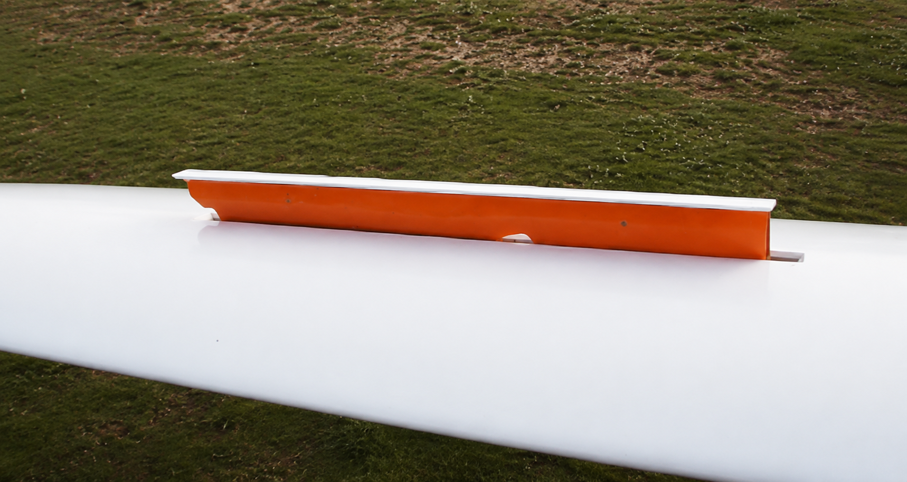
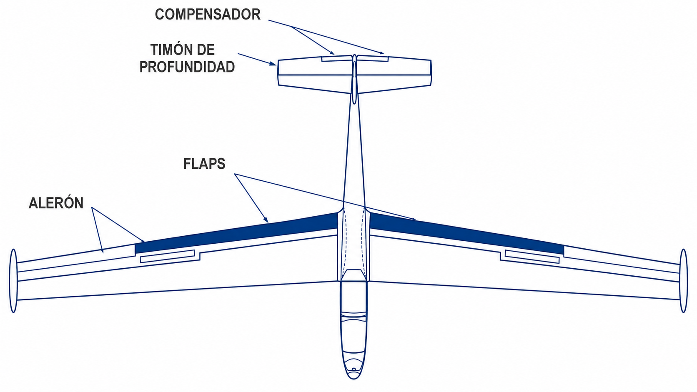
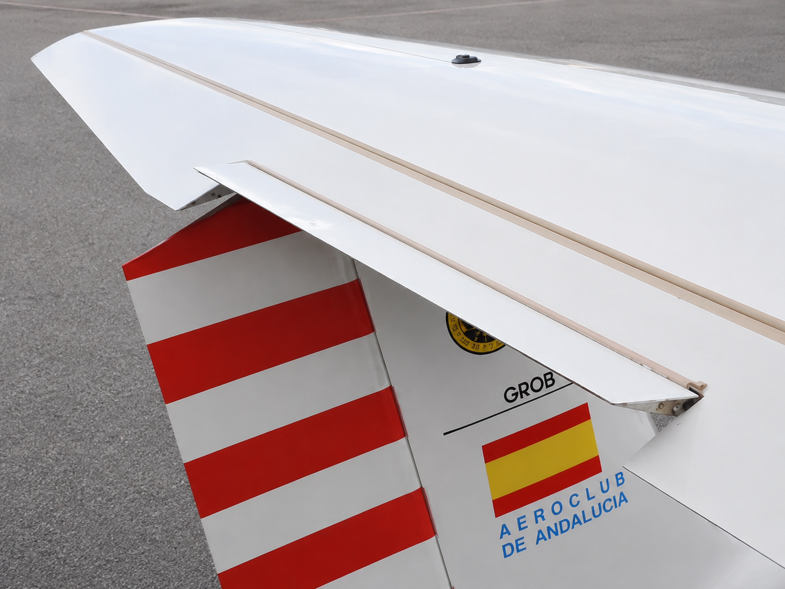

# Flight controls

> Between your hand and the aileron there are several metres of push-rods, rod ends and cables. Knowing that path is what lets you spot on the ground the play, the chafing or the reversed control that in flight could no longer be put right.
>
>
> In this chapter you will learn:
>
>
> * **The primary controls**: ailerons, elevator and rudder, and how movement is transmitted (push-rods and cables).
> * **The airbrakes**: the blue lever and its effect on the glide path.
> * **Flaps**: positive and negative settings on performance sailplanes.
> * **The trim**: spring or tab, and why it saves you so much work.
> * **The full and free, correct-sense control check** before every take-off.

You fly a sailplane with your fingertips. Precise controls let you centre a narrow thermal or nail an approach. And if you understand how your movement travels from the cockpit to the control surfaces, you can catch a fault before take-off.

## The primary controls

They control the sailplane about its three axes:

* **Ailerons**: control roll (longitudinal axis). They move asymmetrically (one up, the other down) to bank the sailplane.
* **Elevator**: controls pitch (lateral axis). When you pull back on the stick, the elevator goes up, the tail goes down and the nose rises.
* **Rudder**: controls yaw (normal axis) through the pedals. You need it to coordinate turns and to counter the adverse yaw from the ailerons.

Most modern sailplanes use rigid push-rods for the elevator and ailerons, because they are precise and free of play, while the rudder is usually worked by high-strength steel cables.

## Airbrakes

The blue lever in the cockpit operates the airbrakes. Their job is to spoil part of the lift and increase drag, which lets you vary the glide angle without having to change your speed much.

{#fig-08-cap05-8-5-3-1-el-aerofreno}

::: {.callout-note title="Airmanship"}
When the airbrakes are opened, most sailplanes drop the nose slightly or vibrate a little. Anticipate it and correct the change of attitude with the elevator so as not to lose your approach speed.
:::

## Flaps

On competition sailplanes and performance two-seaters, flaps change the camber of the wing:

* **Positive settings**: increase lift; good for circling in slow thermals and for landing.
* **Negative settings**: reduce camber and drag; they let you cruise between thermals with minimum loss of height.

{#fig-08-cap05-8-5-3-2-flaps}

## The trim

The green lever, or the electric button that takes the load off the stick, saves you a lot of work. The trim does not “fly” the aircraft: it relieves the pressure you would otherwise have to hold on the elevator to keep a given speed.

* **Spring trim**: the most common; springs “hold” the stick in the chosen position.
* **Trim tab**: a small surface on the trailing edge of the elevator that moves the opposite way.

{#fig-08-cap05-8-5-3-2-el-compensador-trim-tab-en-ingle width="50%"}

::: {.callout-note title="Airmanship"}
The cockpit controls follow a colour code. It is **a certification requirement, not a custom**: CS 22.780 sets it, and CS 22.1555 requires the controls to be marked according to it. **Blue** for the airbrakes, **green** for the trim, **yellow** for the tow cable release and **red** for the canopy jettison (white is for normal canopy opening, and if a single handle does both, red takes precedence). The standard also **reserves** those two colours: no other control in the cockpit may be yellow or red, which is why your eye can trust them. Find them in every sailplane before you fly.
:::

::: {.callout-warning title="Safety"}
Before every take-off, always check that the controls are full and free and move in the correct sense. Take every surface to its stops and check by eye that it moves in the right direction. A reversed control after maintenance is a critical emergency, and it shows itself right at take-off.
:::

::: {.postit}
**Chapter summary: flight controls**

* **Primary controls**: ailerons (roll), elevator (pitch) and rudder (yaw). Rigid push-rods for roll and pitch; cables for the rudder. Check for play, tension and fraying during the inspection.
* **Colour code (CS 22.780)**: blue (airbrakes), green (trim), yellow (tow release), red (canopy jettison). Not a custom: certification requires it, and it also reserves yellow and red for those controls and forbids them for all the others. Recognise it at a glance.
* **Airbrakes**: blue lever. They spoil lift and increase drag to control the glide path. When they are opened the nose tends to drop: correct with the elevator.
* **Flaps**: positive for thermalling and landing; negative for fast glides between thermals. Only on performance sailplanes.
* **Trim**: green lever. It does not fly the aircraft: it relieves the stick pressure for a given speed. Adjust it in every phase of flight.
* **Full and free, correct sense**: a complete control check before every take-off. A reversed control after maintenance is deadly.
:::
