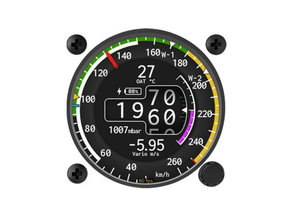
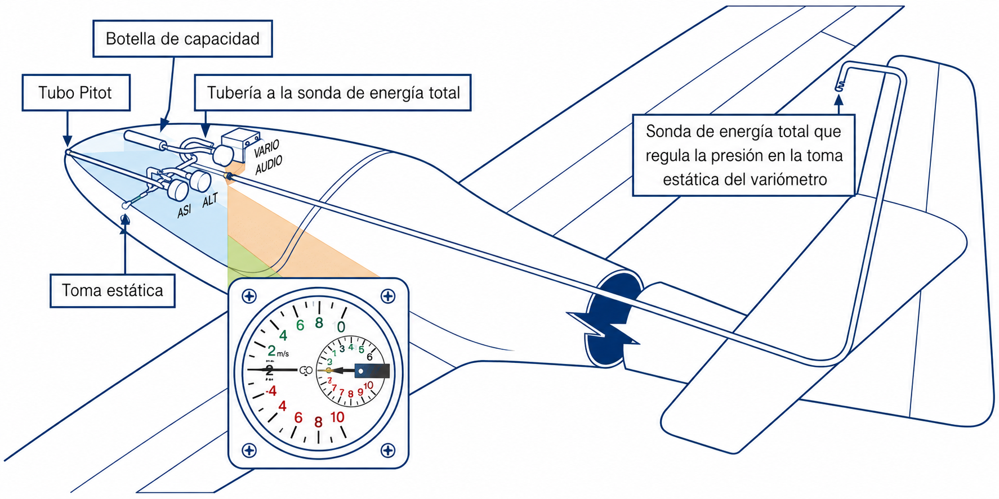
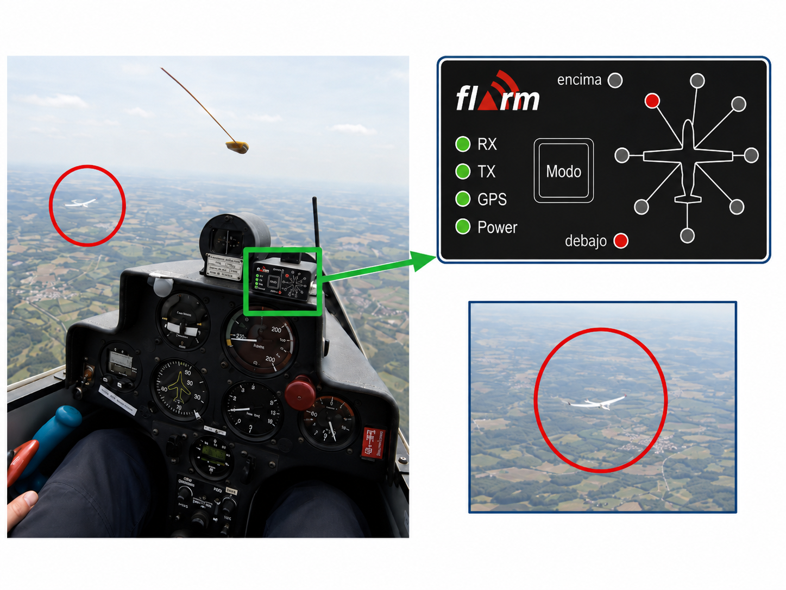

# Instruments

> A sailplane's panel is spartan: three pressure instruments, a radio and not much else. That is exactly why you need to understand what each one measures and how it fails.
>
>
> In this chapter you will learn:
>
>
> * **The pitot-static system**: the pressure sources that feed the basic instruments.
> * **The basic trio**: airspeed indicator (and its colour arcs), altimeter and variometer.
> * **The minimum required equipment**: which instruments the rules require for each type of flight.
> * **The total energy variometer**: why it ignores “stick thermals” and only shows air that is really rising.
> * **Safety avionics**: VHF radio, transponder and FLARM.

The instruments are the pilot's extra “senses”. Much of soaring relies on perception (the sound of the air, the position of the nose, the pressure in the seat), but the instruments give the precision you need to get the most out of the sailplane and fly safely.

## Pressure sources: pitot and static

Almost all the basic instruments work by measuring air pressures:

* **Pitot tube**: usually in the nose or on the leading edge of the fin. It measures the total pressure (static plus dynamic) produced by the aircraft's movement.
* **Static vents**: small holes in the sides of the fuselage that measure the ambient air pressure, unaffected by speed.

::: {.callout-warning title="Safety"}
Pressure sources are a magnet for insects. A spider's nest in the pitot will make your airspeed indicator read zero in the middle of the take-off. Fit protective covers on the ground and check that the sources are clean in the pre-flight inspection. And never blow straight into them: the overpressure bursts the delicate diaphragms of the instruments.
:::

## The basic trio: airspeed indicator, altimeter and variometer

1. **Airspeed indicator (ASI)**: shows the indicated airspeed (*IAS*). It is the most important instrument for safety; if it fails, fly by the sound of the air and the attitude of the nose.
2. **Altimeter**: works as a barometer calibrated in feet or metres. It shows height above a reference (QNH or QFE).
3. **Variometer**: shows vertical speed. In a sailplane it is vital for knowing whether you are in rising air (a thermal) or sinking air.

### The colour arcs on the airspeed indicator

The face of the airspeed indicator carries colour markings that sum up the sailplane's speed limitations:

::: {.arco-blanco}
**White arc**: only on sailplanes with flaps (chapter 5). It marks the operating range for the **positive** settings, from 1.1 times the stalling speed with the flaps in the landing position up to **V~FE~**, the maximum flaps-extended speed. It sits in the lower part of the dial, overlapping the green arc: lowering flaps above V~FE~ can damage the flap and its control. The **negative** settings are a different matter: they are meant precisely for cruising between thermals, they are used well above that arc, and their limits are not on the dial but on the limitations placard and in the Flight Manual.
:::

::: {.arco-verde}
**Green arc**: normal operating range, from 1.1 times the stalling speed up to **V~RA~**, the rough-air speed (CS 22.1545). Do not confuse it with the manoeuvring speed (V~A~): that is a structural limit that is not marked on the dial (it is covered in **Book 5 — Principles of Flight**, chapter 5).
:::

::: {.arco-amarillo}
**Yellow arc**: caution range, from V~RA~ to V~NE~. Only in smooth air and with gentle control movements.
:::

::: {.arco-rojo}
**Red radial line**: V~NE~ (never-exceed speed). An absolute limit, never a target.
:::

The **yellow triangle** found on many sailplanes is not an arc but a separate mark: the recommended approach speed at maximum mass without water ballast.

{#fig-08-cap06-8-6-4-2-anemometro}

These markings are backed up by the aerotow and winch launch speeds given on the limitations placard and in the Flight Manual. And take care in high-altitude wave flying: the **indicated** V~NE~ decreases; the reason is explained in **Book 5 — Principles of Flight**, chapter 5.

## Instruments required by the rules

Not every instrument on the panel is compulsory. The European rules set a minimum that depends on the type of flight, and require more instruments the worse the visibility conditions.

::: {.callout-important title="Regulation"}
**SAO.IDE.105** requires every sailplane to have a means of measuring and displaying the time (in hours and minutes), pressure altitude and indicated airspeed. Powered sailplanes must also have magnetic heading.

For flying in cloud or at night, three more are added: vertical speed, attitude or turn and slip, and magnetic heading. Night flying also requires navigation, anti-collision, landing and cockpit lights.
:::

## Total energy (TE) variometer

If you pull back on the stick, the sailplane climbs but loses speed. An ordinary variometer would show a climb when in fact you have not found any thermal: you have only traded speed for height. The **total energy variometer** (compensated by a venturi or a special probe) ignores these pilot-induced changes and only shows a climb when it really is the air mass pushing you upwards.

Modern electronic variometers add audio signals (beeps) that let you centre the thermal without taking your eyes off the sky, which also improves your lookout for traffic.

{#fig-08-cap06-un-sistema-de-variometro-de-energia-tota}

## Avionics: communication and safety

* **VHF radio**: essential for coordinating at the airfield and with air traffic control. Keep transmissions short to save the battery.
* **Transponder**: makes the sailplane visible to controllers' radars and to the anti-collision systems (TCAS) of airliners.
* **FLARM**: the star system of gliding. It warns of other sailplanes nearby and of possible collision courses, with visual and audio alerts.

{#fig-08-cap06-4-2-ver-y-evitar}

Some sailplanes also carry a magnetic compass and, as the cheapest and most reliable “instrument” of all, the yaw string taped to the canopy, which shows a sideslip better than any needle. Magnetism and the use of the compass are covered in **Book 9 — Navigation**, chapter 2; the yaw string in **Book 5 — Principles of Flight**, chapter 4.

::: {.postit}
**Chapter summary: instruments**

* **Pitot and static**: the aircraft's senses. The pitot (nose or tail) measures total pressure; the static vents (fuselage) measure ambient pressure. If they are blocked (insects, water), you lose your speed and height information.
* **Airspeed indicator**: know your colour arcs. White (flapped sailplanes only): positive settings, up to V~FE~; negative settings are used faster and their limit is on the placard, not on the dial. Green: normal, up to V~RA~ (rough-air speed). Yellow: caution, from V~RA~ to V~NE~ (smooth air only). Red line: V~NE~, danger to life. Yellow triangle: approach speed at maximum mass without water ballast.
* **Minimum equipment (SAO.IDE.105)**: time, pressure altitude and indicated airspeed for every sailplane (plus magnetic heading if powered). For cloud or night, vertical speed, attitude or turn and slip, and magnetic heading are added.
* **Altimeter**: remember to set it. QNH for altitude above mean sea level (routes, airspace); QFE for height above the airfield (circuit).
* **Variometer (total energy)**: the key tool. It ignores “stick thermals” (which trade speed for height) and only tells you whether the air mass is rising or sinking.
* **Avionics**: VHF radio, transponder and FLARM. FLARM is the anti-collision safety net of gliding.
:::
