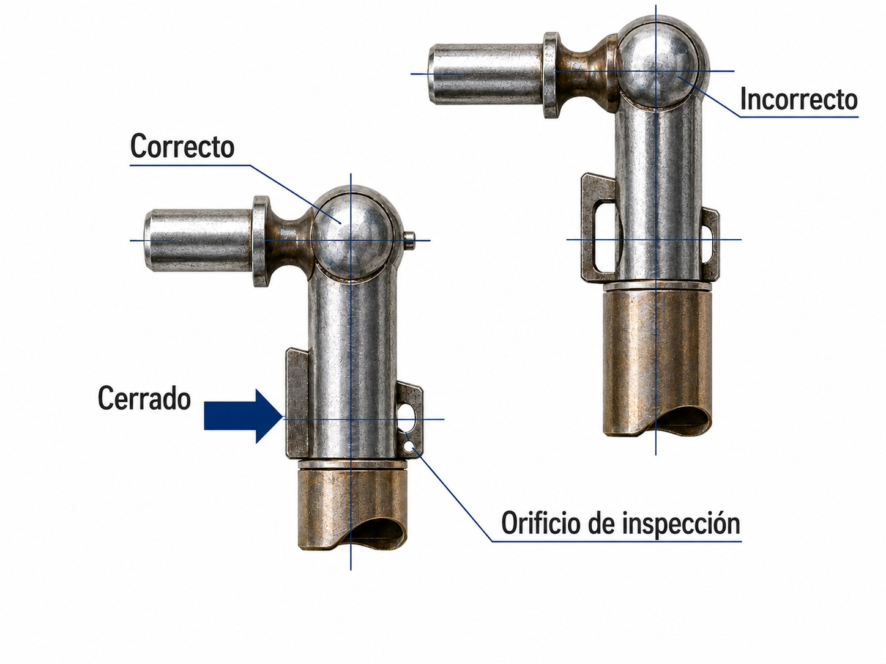

# Rigging of aircraft, connection of control surfaces

> Every time you rig a sailplane you are rebuilding an aircraft. Accidents caused by forgotten connections have been happening for decades, and they all share the same pattern: haste, distraction and no final check.
>
>
> In this chapter you will learn:
>
>
> * **The rigging process**: the correct order, and how to look after the spigots and main pins.
> * **Control connections**: automatic and manual (L'Hotellier), and why the manual ones need a safety pin.
> * **The pins and locks** of the wing-to-fuselage joint.
> * **The Positive Control Check (PCC)**: the check with a helper that closes the rigging.
> * **Taping**: why the tape over the joints is not there for looks.

Rigging is one of the jobs that matter most to safety. A badly assembled sailplane behaves unpredictably or, at worst, suffers a catastrophic failure in flight. Your best tools are discipline and the Aircraft Flight Manual (AFM), followed to the letter.

## The rigging process

Each type has its own details, but the general order is usually this:

1. **Fuselage**: it is taken out of the trailer and secured upright in its cradle or trestle.
2. **Wings**: the spars are inserted into the fuselage in the exact order the flight manual specifies (left or right first, depending on how the spars overlap). Before fitting them, clean the spigots and main pins and grease them lightly.
3. **Tailplane**: the horizontal stabiliser goes on last, making sure it is mechanically secured.

## Control connections

Depending on the age of the sailplane, the aileron, airbrake and elevator connections can be of two types:

* **Automatic connections**: when the wing or the tailplane is seated, the controls connect themselves through funnels or built-in ball joints. These are the safest.
* **Manual connections (L'Hotellier)**: the pilot has to connect a ball joint by hand. They are critical connections and have caused many accidents when forgotten (see @fig-08-cap07-conectores-mandos).

{#fig-08-cap07-conectores-mandos}

::: {.callout-warning title="Safety"}
If your sailplane uses L'Hotellier connectors, the safety pin that locks the connector is mandatory on the types covered by the relevant airworthiness directive. Never trust the “click” of the spring: it is the pin that ensures the joint cannot come apart under the vibration of flight.
:::

## Pins and locks

The main joint between the wings and the fuselage is made with main pins. They must go in smoothly; do not use brute force or hammers, because you would damage the bushes. Once in, they must be locked by their own safety catches or by additional pins.

## Taping the joints

After rigging, the joints between wing and fuselage, and those of the tailplane, are sealed with purpose-made adhesive tape. It is not for looks: the tape stops air leaks that create drag and noise, and it improves low-speed performance considerably. Use tape in good condition and watch that its edges do not lift; a loose tape fluttering in flight can make you think the problem is more serious than it is.

## Final check: the Positive Control Check (PCC)

Once the aircraft is rigged, never fly without a positive control check with a helper:

1. The pilot sits in the cockpit and moves the controls.
2. The helper holds the surface (the aileron, for example) firmly and tries to stop it moving.
3. The aim is to check not only that the surface moves in the correct sense, but that the connection is firm, solid and free of play.

::: {.callout-tip title="Golden rule"}
If someone interrupts you to talk while you are rigging, start the step you were on again from the beginning. Distraction during rigging is the number one cause of forgotten critical connections.
:::

::: {.postit}
**Chapter summary: rigging**

* **Control check**: after rigging, the positive control check (PCC) is compulsory. One person holds the surface (the aileron) and you try to move the stick. It must meet solid resistance. If it moves freely, it is not connected.
* **Main pins**: they are the wings' life insurance. They must go in clean and be locked (safety pins or R-clips).
* **L'Hotellier**: a critical manual connection. Always a safety pin; the click of the spring is not enough.
* **Taping**: covering the wing-to-fuselage joints is not just for looks; it reduces noise and improves low-speed performance considerably.
* **Loose items**: a classic fatal error is to leave tools or weights loose in the fuselage after rigging. They can shift in flight and jam the controls.
:::
