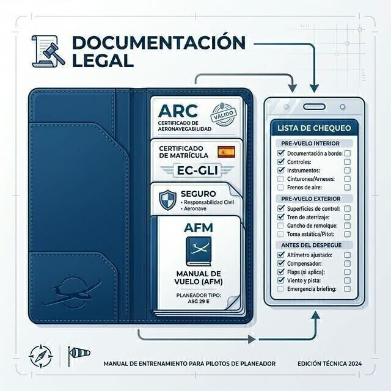

# Manuals and documents

> A sailplane that is legally in order matters as much as one that is mechanically in order: without the paperwork in place, neither the insurance nor the certificate of airworthiness covers you.
>
>
> In this chapter you will learn:
>
>
> * **The Flight Manual (AFM)**: what it contains and why it is the master document.
> * **The documents on board and at the aerodrome** under SAO.GEN.155, and the exception for local flights.
> * **Checklists**: CB-SIFT-CBE and the discipline of read, check and confirm.
> * **The aircraft logbook**: the sailplane's medical history.

Flying is not just piloting: it also means managing the legal side and the technical information of the aircraft. A pilot who does not know the limitations of their machine, or who flies without the paperwork in order, is exposed to operational risks and to penalties.

## The flight manual (AFM / SFM)

The **Flight Manual** (*AFM, Aircraft Flight Manual*, or *SFM, Sailplane Flight Manual*, for sailplanes) is the master document. It is not a generic user's guide, but a document legally tied to your sailplane's registration. In it you will find:

* **Limitations**: speeds (V~NE~, never-exceed speed; V~A~, manoeuvring speed), load factors, maximum masses.
* **Emergency procedures**: what to do in case of fire, a cable break or a control failure.
* **Performance**: glide tables, take-off and landing distances.
* **Mass and balance**: centre of gravity limits.

## Documents on board and at the aerodrome

The European rules for sailplane operations distinguish between what must be carried in the sailplane and what can stay at the aerodrome:

**On board on every flight (originals or copies):**

* Flight Manual (AFM) or equivalent document.
* Current aeronautical charts suitable for the area of the flight.
* Information on interception procedures and visual signals.
* Details of the filed ATS flight plan, when applicable.
* Pilot licence, medical certificate, photo identity document and enough logbook data (required by the licensing rules, SFCL.045).

**At the aerodrome or operating site (available):**

* Certificate of registration (CoR).
* Certificate of airworthiness (CofA) with its annexes, and the airworthiness review certificate (ARC).
* Noise certificate (for a powered sailplane).
* Aircraft radio licence (if it has radio equipment).
* Current third-party liability insurance.
* Journey log or equivalent record.

::: {.callout-important title="Regulation"}
**SAO.GEN.155** requires the AFM, current charts and the interception signals information to be carried on every flight; the certificates (registration, airworthiness, ARC, insurance, radio licence) may stay at the aerodrome. There is one exception: on flights that remain within sight of the aerodrome, or within the distance set by the competent authority, all the documents (including the AFM) may stay on the ground. The same applies to the pilot's licence and medical certificate (SFCL.045).
:::

## Checklists

Human memory fails, above all under stress or when distracted. A serious pilot uses checklists every time; a casual one trusts memory.

There are several kinds of check:

1. **Pre-flight inspection**: a visual walk-round, outside and inside, following the AFM.
2. **Cockpit check**: just before take-off. The standard European mnemonic is **CB-SIFT-CBE**; many Spanish clubs also use the traditional **CRISE** (from Spanish words). Both are developed in **Book 6 — Operational Procedures**, chapter 1.
3. **Downwind check**: before landing (the FUSTALL or WULF mnemonics, set out in **Book 6 — Operational Procedures**, chapter 4).

::: {.callout-tip title="Golden rule"}
Do not recite the checklist from memory. Read each item, physically check the control or instrument and confirm its state out loud. If you skip a step, start the list again.
:::

## Aircraft logbook and maintenance

Every flying hour and every landing is recorded in the **Aircraft Logbook**. It is how the inspections in the maintenance programme are tracked, and it is the sailplane's medical history. Do not take off if the aircraft has an open defect that affects safety, or if the hours or the date for the next scheduled inspection have already run out.

{#fig-08-cap08-documentos-bordo}

::: {.postit}
**Chapter summary: aircraft documents**

* **Flight Manual (AFM)**: on board on every flight (except flights within sight of the aerodrome). It contains the limits (V~NE~, load factors), the emergency procedures and the loading tables. Read it before flying a new type.
* **Certificates**: the aircraft needs a certificate of airworthiness, a valid ARC, insurance and an aircraft radio licence. They may stay at the aerodrome (SAO.GEN.155). Without a valid ARC you do not fly, and the insurer may refuse to cover you or seek recovery from you, depending on the policy.
* **Checks**: CB-SIFT-CBE before take-off, FUSTALL/WULF on the downwind leg. Read, check and confirm; never from memory.
* **Technical log**: before flying, check that there are no outstanding defects that affect you. Afterwards, record your flight and any problem.
:::
