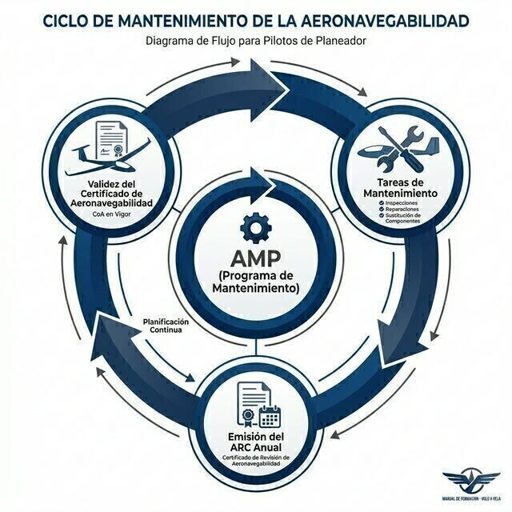

# Airworthiness and maintenance

> Airworthiness is not a piece of paper you obtain once: it is a state that is kept up flight by flight, inspection by inspection.
>
>
> In this chapter you will learn:
>
>
> * **The CofA and the ARC**: the two certificates that allow you to take off legally, and how the ARC is renewed or extended.
> * **Part-ML and Part-CAO**: the simplified maintenance framework for European light aviation.
> * **Pilot-owner maintenance**: which tasks you can sign off yourself, and on what conditions.
> * **ADs and SBs**: the mandatory orders and the manufacturer's recommendations.

**Airworthiness** is the legal and technical condition that certifies that an aircraft is safe to fly. It is not something static: keeping a sailplane airworthy takes constant vigilance, a rigorous maintenance programme and following the European rules to the letter.

## The CofA and the ARC: the aircraft's roadworthiness test

For a sailplane to take off legally, it needs two key documents:

1. **Certificate of airworthiness (CofA)**: the aircraft's technical identity card. It describes its characteristics and certifies that the type is fit to fly. It is usually valid indefinitely, as long as the aircraft is properly maintained.
2. **Airworthiness review certificate (ARC)**: the periodic validation of the CofA, valid for one year. It is issued by an approved organisation (CAMO or CAO) or by independent certifying staff after reviewing the aircraft and its records. It plays the part that the periodic roadworthiness test (the Spanish ITV) plays for a car.

::: {.callout-important title="Regulation"}
Under **ML.A.901**, the ARC is valid for one year. It can be extended twice in succession, one year each time, without a full review if the aircraft has remained in a **controlled environment**: continuous management by a CAMO/CAO and maintenance carried out by approved organisations. After those two extensions a full airworthiness review is due.
:::

This chapter covers the technical side of the CofA and the ARC in full. The legal side (which documents are compulsory on board, and your legal responsibility for flying with them valid) is covered in **Book 1 — Air Law and ATC Procedures**, chapter 2.

## EASA rules: Part-ML and Part-CAO

Light aviation has simplified rules, which cut the red tape without relaxing on safety:

* **Part-ML**: the specific rules for sailplanes and light aeroplanes. It allows the Aircraft Maintenance Programme (AMP) to be declared by the owner, who in doing so takes on more responsibility for their aircraft.
* **Part-CAO**: regulates the organisations approved to carry out maintenance and manage airworthiness in combination.

When the AMP is based on the **Minimum Inspection Programme (MIP)** set out in Part-ML itself (ML.A.302), the MIP sets a regulatory floor: an inspection at least **every year or every 100 flying hours, whichever comes first**. The AMP can be stricter (whatever the manufacturer says), but never less than that minimum.

## Pilot-owner maintenance

EASA allows you, as pilot and owner, to carry out certain simple maintenance tasks without going to a certified workshop: changing tyres, cleaning filters, replacing spark plugs (on powered sailplanes) or lubricating, among others. They are listed in Appendix II to Part-ML, together with whatever your aircraft's maintenance programme says.

::: {.callout-important title="Regulation"}
You may only sign off pilot-owner tasks if you are the legal owner (or joint owner) of the aircraft and hold a valid pilot licence (ML.A.803). And every task must be recorded and signed in the Aircraft Logbook, with your licence number.
:::

## ADs and SBs: mandatory orders

Aviation safety is everyone's business. When a design fault or a problem with a particular type is found, two instruments come into play:

* **Airworthiness directive (AD)**: issued by EASA and mandatory by law. If a sailplane has an outstanding AD that is not complied with in time, it is automatically grounded (*AOG, Aircraft On Ground*).
* **Service bulletin (SB)**: issued by the manufacturer. They are usually recommended improvements. They are not always legally binding, but ignoring them can affect safety and the aircraft's resale value.

{#fig-08-cap09-ciclo-mantenimiento width="50%"}

::: {.postit}
**Chapter summary: maintenance and airworthiness**

* **Daily inspection (DI)**: the pilot's job. Follow the list: tyre pressures, condition of the towhook, control hinges, pitot and static vents clean.
* **CofA and ARC**: the CofA is valid indefinitely; the ARC lasts a year and can be extended twice in a controlled environment (ML.A.901). Without a valid ARC, the aircraft does not fly.
* **Scheduled maintenance**: the actual inspection frequency (by time, cycles or hours) is set by the AMP, according to what the manufacturer says. But there is a floor: if the AMP is based on the Part-ML Minimum Inspection Programme (ML.A.302), it can never be less restrictive than **an inspection every year or every 100 h, whichever comes first**.
* **Pilot-owner maintenance**: simple tasks from Appendix II to Part-ML, only if you are the owner and hold a valid licence, and always recorded and signed (ML.A.803).
* **Defect reporting**: if you break something or see something odd, write it down. The next pilot may not see it and be killed (a frayed rudder cable, for example).
:::
