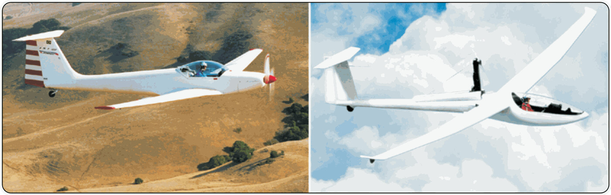

# Airframe, engines and propellers

> The engine has given gliding a safety net against outlandings, and in exchange it has added new failure modes that the pilot has to master.
>
>
> In this chapter you will learn:
>
>
> * **Powered configurations**: sustainer (**turbo**), self-launcher and touring motor glider (TMG).
> * **Types of engine**: two-stroke, four-stroke and electric (FES).
> * **The systems of a combustion engine**: magneto ignition, carburation and carburettor icing, and fuel.
> * **The retractable pylon and propellers** that fold or park in position, and blade pitch.
> * **Managing the engine in flight**: starting sequence, decision heights and instruments.

The engine has changed gliding: it has broken the total dependence on external launch methods and has provided a safety net against outlandings. In exchange, it adds mechanical complexity and new responsibilities for the pilot.

## Turbo or self-launcher

Not all engines do the same job:

* **Sustainer or “turbo”**: a small engine (almost always two-stroke) without the power to take off. Its job is to keep you in the air and bring you home if the thermals fail.
* **Self-launcher**: a powerful engine that lets the sailplane take off on its own from the runway. Once the chosen height is reached, it is shut down and stowed completely.
* **Touring motor glider (TMG)**: aircraft with a fixed (non-retractable) engine, such as the Super Dimona, halfway between a light aeroplane and a sailplane.

## Types of engine

1. **Two-stroke engines**: very common in retractable systems because they are light and powerful. They need a petrol and oil mixture, and they are noisier and vibrate more than four-strokes.
2. **Electric engines (FES)**: the big new arrival. They use a folding propeller in the nose and lithium batteries. They are extremely reliable, quiet and start instantly.
3. **Four-stroke engines**: mainly in TMGs. Heavier, but more efficient and mechanically more reliable.

## Combustion engine systems

Touring motor gliders (TMG) and self-launchers with a combustion engine add three systems the pilot must understand, because their failures have their own procedures.

### Ignition: the magnetos

Ignition is produced by the *magnetos*, not by the battery. A magneto is a self-contained generator: as long as the crankshaft turns, it produces by itself the high voltage the spark plugs need, independently of the battery and the alternator. That is why the engine keeps running even if the electrical system fails. Aero engines have *dual* ignition (two magnetos and two spark plugs per cylinder) for safety and performance; before flight the magneto check is done, confirming the small RPM drop when only one is left running.

::: {.callout-warning title="Safety"}
Because the magneto generates current by itself, to stop it its primary winding has to be earthed (short-circuited). A magneto with a broken earth lead can leave the engine “live” even with the switch at *OFF*: always treat the propeller as if it could start.
:::

### Carburation and icing

Many engines feed the cylinders through a carburettor. As the air expands and the fuel vaporises, the mixture cools, and that drop in temperature can freeze the moisture in the air inside the carburettor: this is *carburettor icing*. The risk is greatest between −7 °C and +21 °C in high humidity, and its first symptom is a drop in RPM.

To clear it, *carburettor heat* is used, which brings in hot air from around the exhaust manifold. It reduces power, so use it with judgement: never on take-off, only as needed on the ground, in the cruise only if there is a risk of icing, and before reducing power on the approach.

### Fuel

Motor gliders use AVGAS (aviation gasoline, leaded) or MOGAS (motor gasoline), always the one the AFM specifies. Before flight a sample is drained to rule out water or contamination, which can stop the engine: water, being denser, settles at the bottom of the fuel *tester*. As for quantity, the rules (SAO.OP.120) require enough fuel to complete the flight safely; the prudent practice is never to take off with less than 30–45 minutes' reserve.

## The propeller and the pylon

On most self-launchers, the engine is mounted on a retractable pylon behind the pilot.

* **Retractable propellers**: the blades stop in a precise vertical position (with a position sensor or a mechanical stop) so that they can be stowed inside the fuselage.
* **Folding propellers (FES)**: in the nose, centrifugal force opens them as they turn, and air pressure folds them back against the fuselage when the motor stops.

Depending on blade pitch, the propeller can be *fixed pitch* (the blade angle does not change: simple and robust) or *variable pitch / constant speed* (a governor adjusts the angle: fine pitch and higher RPM for take-off, coarse pitch for an efficient cruise).

## Managing and operating the engine

Handling a sailplane's engine demands discipline. The starting sequence (extension, opening the doors, switching on the fuel pump, starting) must be perfectly memorised.

::: {.callout-warning title="Safety"}
With the engine extended, the glide ratio drops sharply because of the drag of the pylon. If the engine does not start once it is out, you must be high enough to make the emergency landing with the engine extended, or to retract it in time. Always choose your field before trying to start: the engine is plan B, never plan A.
:::

{#fig-08-cap10-motor-retractil}

## Instruments and fuel

The electronic control unit (such as the ILEC) manages RPM and the cylinder head (CHT) and exhaust gas (EGT) temperatures. The motor glider pilot must keep a close eye on fuel level and temperature, because a two-stroke engine is very sensitive to overheating.

::: {.postit}
**Chapter summary: motor gliders and retractable systems**

* **Complexity**: an engine adds weight, complexity and failure modes. An in-flight start uses up height; that is why the minimum height for trying one is 300 m (see **Book 6 — Operational Procedures**, chapter 2).
* **Failure to start**: always have a field chosen before trying to start. If the engine will not come out or will not fire, you are left with a sailplane carrying a giant “airbrake” (the pylon): the glide is cut in half.
* **Shock cooling**: do not stop the engine abruptly after a full-power climb. Let it cool at idle, or glide for a few minutes with the engine extended, to avoid cracks in the cylinder head.
* **Propeller**: make sure it is braked and vertical before retracting. The mirror is your friend. Fixed pitch or variable pitch (constant speed), depending on the type.
* **Combustion engine**: magneto ignition is independent of the battery (to stop it, the primary is earthed). Watch for carburettor icing (−7 to +21 °C in humid air; first symptom, a drop in RPM) and drain the fuel before flight.
:::
