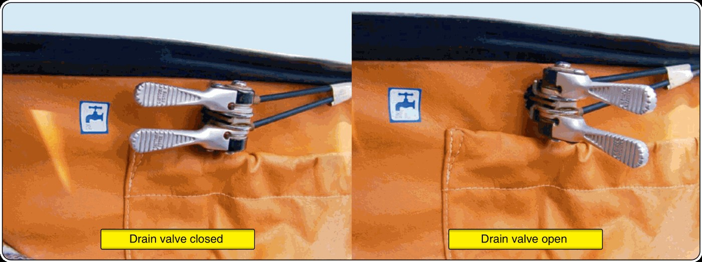

# Water ballast systems

> Water in the wings is the “turbo” of strong thermal days: higher wing loading, higher cruising speed. But a badly managed ballast system turns that advantage into an emergency.
>
>
> In this chapter you will learn:
>
>
> * **What ballast is for**: wing loading and shifting the speed polar.
> * **The components of the system**: tanks or bags, dump valves and vents.
> * **Filling and dumping**: symmetry, times and checks.
> * **The risks**: freezing, asymmetric dumping and landing with water.
> * **Fin ballast**: the counterweight that restores the best balance.

**Water ballast** is what lets competition sailplanes match their weight to the conditions of the day. With more weight, the sailplane flies faster while losing less height, which is decisive for covering long distances when the thermals are strong.

## What it is for: wing loading and speed

Adding water increases the **wing loading**, and that shifts the speed polar to the right: the best glide speed rises and the glides between thermals become much faster. It comes at a price: the sailplane climbs worse in weak thermals and its stalling speed is higher. The effect of ballast on the polar is covered in **Book 7 — Flight Performance and Planning**, chapter 2.

## Components of the system

The system is simple in concept, but it needs scrupulous maintenance:

* **Tanks or bags**: inside the wings, near the spar. They can be rubber bags or sealed compartments built into the structure.
* **Dump valves**: they drain the water overboard. They are operated from the cockpit, usually with a small lever.
* **Vents**: holes that let air in as the water runs out. If one gets blocked, the suction can damage the wing structure.

{#fig-08-cap11-lastre-agua}

## Filling and dumping

The tanks are filled through openings on the upper surface of the wing. It is essential that both wings take the same amount of water, to keep lateral symmetry.

Dumping in flight usually takes between 3 and 8 minutes, depending on the sailplane. When you open the valves you will see two trails of water coming out of the wings: confirmation that the system is working.

::: {.callout-warning title="Safety"}
Dump the water ballast before landing; it is an operating limitation in the Flight Manual. The sailplane is not designed to take the impact loads of a landing with full tanks. Landing with water also greatly lengthens the landing run and increases the risk of structural damage if you hit an obstacle.
:::

## Risks and limitations

1. **Freezing**: do not carry water if you are going to fly above the freezing level (0 °C). Water expands when it freezes and can burst the tanks or jam the valves.
2. **Asymmetry**: if a valve jams and only one wing empties, you will have a dangerous lateral imbalance. Fly somewhat faster to keep control and be ready for a landing with one wing “heavy”.
3. **Damp**: always empty the tanks after flight and let them dry, to prevent mould and corrosion in the valves.

## Fin ballast

To offset the shift in the centre of gravity caused by the water in the wings, some sailplanes have a small tank in the fin. Filling that tail tank restores the sailplane's best balance for flying fast.

::: {.postit}
**Chapter summary: water ballast**

* **What it is for**: increasing the wing loading and shifting the polar to the right (flying faster for the same glide angle). Only worth it with strong thermals.
* **Risk of ice**: water expands when it freezes. If you climb above the freezing level, it can burst the internal structure of the wing. Dump before climbing.
* **Asymmetric dumping**: if a valve fails and you are left with water in one wing only, you have a serious lateral control emergency. Land with extra speed and care: the aircraft will want to roll towards the heavy wing.
* **Before landing**: dump the water. Landing with ballast punishes the undercarriage and the structure for no reason, and raises the landing speed.
:::
