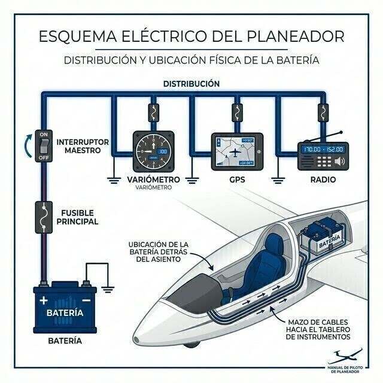

# Batteries (performance and operational limitations)

> A sailplane flies without an engine, but not without electricity: the radio, FLARM, transponder and variometers all depend on the battery. Managing it well is managing your safety.
>
>
> In this chapter you will learn:
>
>
> * **Types of battery**: lead-acid (gel/AGM) and lithium (LiFePO4), with their advantages and precautions.
> * **Securing the battery**: why certification requires crash-proof mountings.
> * **Managing energy in flight**: ampere-hours, consumption and the effect of cold.
> * **Protecting the system**: fuses and circuit breakers.

The sailplane flies without an engine, but not without electricity. The radio, transponder, FLARM and electronic variometers need a reliable source of power. On long flights, managing the battery is as important as managing the fuel in a powered aeroplane.

## Types of battery

Two technologies dominate in recreational aviation:

* **Lead-acid (gel/AGM)**: the most common, because they are cheap and reliable. They are sealed and maintenance-free, but they are fairly heavy (between 2.5 and 4 kg each).
* **Lithium (LiFePO4)**: much lighter, with a flatter discharge (they hold their voltage almost to the end). In exchange, they need specific chargers and careful handling to avoid fires from short circuits.

## Location and structural safety

The battery is usually carried in the centre section of the fuselage, behind the pilot, or in a compartment in the nose (to help the balance).

It packs a lot of mass into a small space, so the way it is secured is a critical inspection point. A badly secured battery becomes a deadly projectile in a heavy landing or an accident.

::: {.callout-important title="Regulation"}
**CS 22.561(d)** requires the supporting structure to restrain any item of mass that could injure an occupant if it came loose in a crash landing, under the ultimate inertia forces of **CS 22.561(b)(1)**: 15g forward, 9g downward, 7.5g upward and 6g sideward. Never secure the battery with bungee cords or improvised mountings: use the brackets or straps approved by the manufacturer and check that they are firm at every pre-flight inspection.
:::

## Managing energy in flight

Capacity is measured in ampere-hours (Ah). A 12 Ah battery can, in theory, power a device drawing 1 ampere for 12 hours.

But performance drops a lot in the cold: at 0 °C you have about 80 % of the rated capacity left. If you are planning a long flight at altitude, take off with the batteries at 100 %.

And if you are going to fly in cloud (with the relevant rating), do not take off without the batteries practically full. With no visual references, your instruments are the only thing keeping your wings level, and running out of power inside a cloud is a major emergency. The rules do not set a specific percentage; managing the energy available is your responsibility (SAO.OP.145 for powered sailplanes).

## Protecting the system: fuses

The whole electrical system has to be protected to prevent fires.

* **Fuses**: fitted as close as possible to the positive terminal of the battery. A typical value in sailplanes is 5 amperes, although the correct one is always the one on your aircraft's wiring diagram.
* **Circuit breakers**: on powered sailplanes, because of the high current drawn when starting, breakers are used that can be reset in flight.

::: {.callout-tip title="Golden rule"}
Always carry spare fuses in the cockpit pocket. If one blows in flight, replace it once. If it blows again, switch off the equipment concerned: you have a serious short circuit that can end in an electrical fire.
:::

{#fig-08-cap12-sistema-electrico}

::: {.postit}
**Chapter summary: batteries and electrical system**

* **Types**: lead-acid/gel (heavy, robust, cheap) against LiFePO4 (light, steady voltage, specific charger).
* **Fuses**: essential. As close as possible to the battery terminal. A short circuit in flight without a fuse means fire in the cockpit within seconds.
* **Effect of cold**: batteries lose capacity suddenly in the cold. One that seems full on the ground can die quickly in wave at −20 °C.
* **Cloud flying**: take off with the batteries practically full. With no visual references, the instruments are your life, and no rule will save you from a flat battery inside a cloud.
* **Securing**: the battery is a projectile weighing several kilos. Its mounting must withstand 15g forward (CS 22.561). Check that its “seat belt” is tight and locked before every flight.
:::
