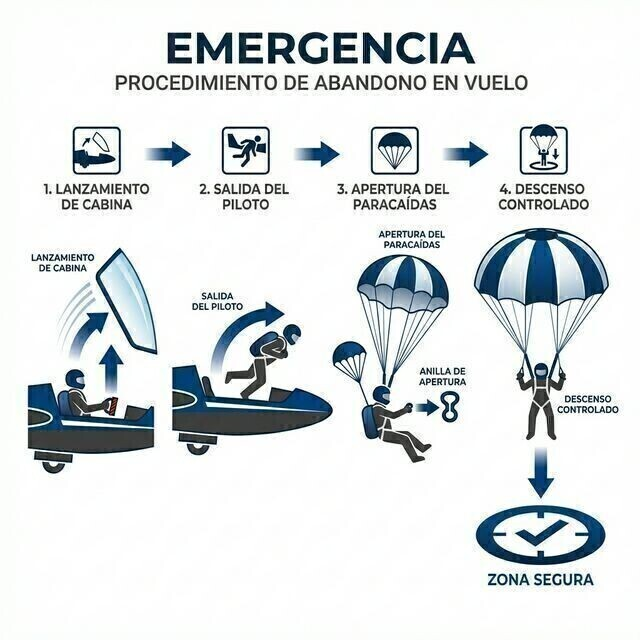

# Emergency parachutes

> The emergency parachute is the one piece of sailplane equipment you hope never to use, and that is exactly why it needs flawless maintenance and fitting.
>
>
> In this chapter you will learn:
>
>
> * **The parachute as a system**: canopy, container, ripcord handle and the enemies of nylon.
> * **Maintenance**: periodic repacking, service life and daily care.
> * **Putting on and adjusting the harness**: why a loose harness causes injuries.
> * **The bail-out sequence**, in summary; the full training is in **Book 6 — Operational Procedures**, chapter 8.

The emergency parachute is the equipment no pilot wants to use for the first time, but that every pilot has to know how to handle perfectly. In gliding, where the risk of a collision in a thermal is real, it is your last line of defence.

## The parachute: your life insurance

Most sailplane parachutes are manually opened. The canopy is packed in a container that the pilot wears on their back and which also serves as the seat back.

It is not a passive object: it is a precision mechanical system with its own care requirements.

* **Damp**: sweat or rain make the fabric stick together and delay opening.
* **UV rays**: sunlight degrades the nylon fibres. Always keep the parachute in its bag or inside the closed cockpit.

## Maintenance and packing

The air trapped between the folds of the fabric is gradually lost over time. That is why the manufacturer requires periodic repacking by certified staff (usually every 6 or 12 months, depending on the model). Parachutes also have a maximum service life (often 15 or 20 years) set by the manufacturer, after which they are withdrawn from service.

::: {.callout-tip title="Golden rule"}
A parachute packed a week ago opens much sooner than one packed a year ago. Do not stretch the inspection periods: those seconds of difference in opening can be vital at low height.
:::

## Putting it on and adjusting it

The parachute must fit your body, not the seat. Leg straps tight (but still letting you walk), and the chest strap fastened. If you jump with a loose harness, the jolt of the opening can cause serious injuries to your spine or shoulders.

## The bail-out sequence

**Bail-out** from the sailplane, in an emergency that has left it uncontrollable (a collision, a structural failure), demands a sequence that is crystal clear in your head:

1. **Jettison the canopy**: pull the red emergency handle.
2. **Release the harness**: open the central safety buckle.
3. **Jump**: push yourself out.
4. **Pull the ripcord**: grip the handle firmly and pull hard, straightening your arm.

The full procedure (the decision to bail out, getting out under g forces, the descent under the canopy and the landing, including landings in water and on power lines) is set out in **Book 6 — Operational Procedures, chapter 8**. Here we stay with the equipment: if the parachute is not properly packed, properly adjusted and within its service life, the best jumping technique will be of no use to you.

::: {.callout-warning title="Safety"}
The minimum recommended height for a jump with a reasonable chance of success is 150 metres above the ground: the canopy needs between 50 and 90 metres to deploy fully, and getting out uses up the first 100. Below that height the margin is critical. If the emergency happens high up, do not hesitate: every second of delay is height lost.
:::

{#fig-08-cap13-secuencia-salto}

::: {.postit}
**Chapter summary: parachute (system)**

* **Maintenance**: it does not last for ever. It needs periodic repacking and airing by a certified **rigger** (every 6–12 months, depending on the manufacturer), and it has a maximum service life (15 or 20 years, for example).
* **Fit**: harness snug to the body, leg straps tight, chest strap fastened. A loose harness turns the opening jolt into an injury.
* **Daily care**: UV light, damp and dirt are its enemies. Always carry it in its bag and do not leave it lying on the runway.
* **Sequence**: canopy, harness, jump, ripcord. Recommended minimum: 150 m AGL. The full procedure is trained with **Book 6 — Operational Procedures**, chapter 8.
:::
