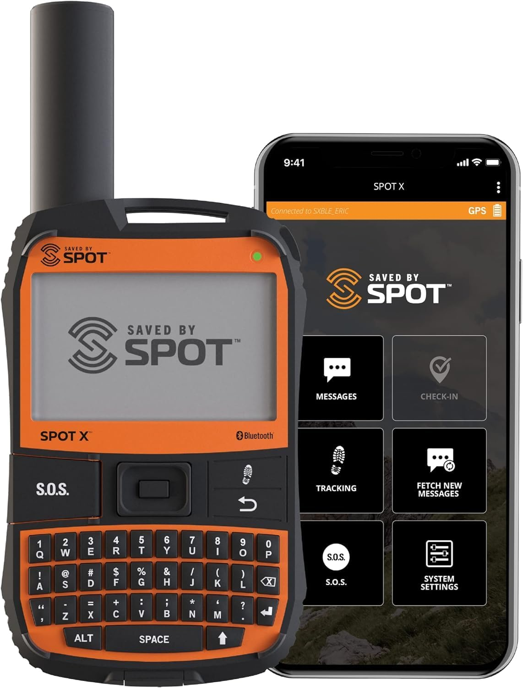
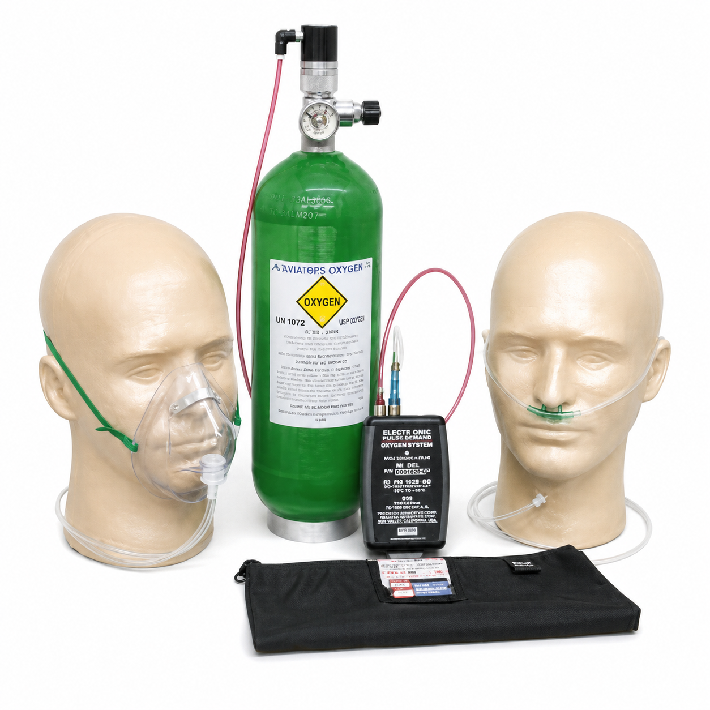
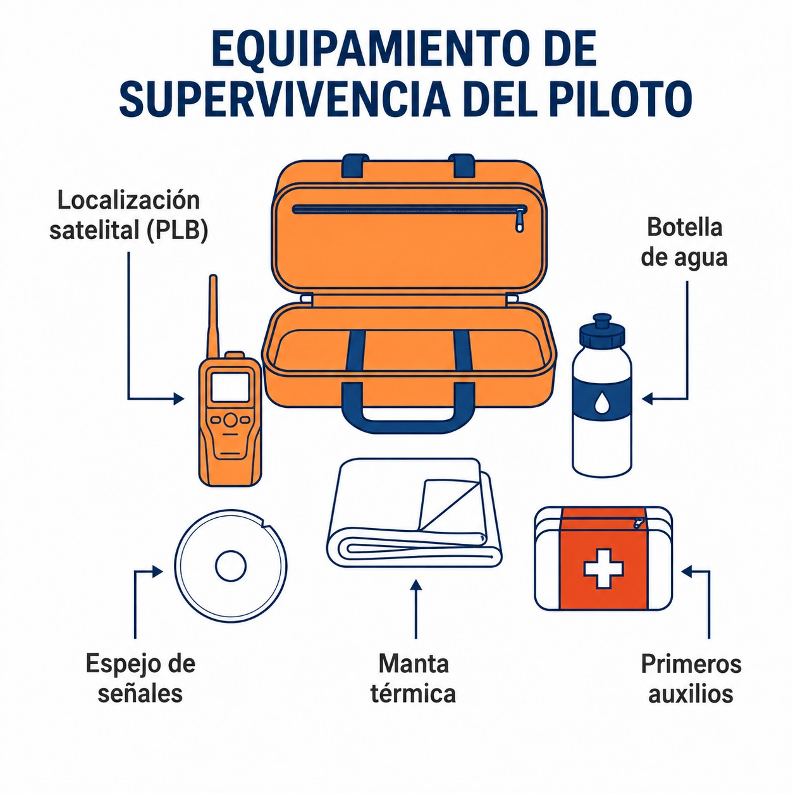

# Emergency bail-out aid

> If the flight ends badly and far from home, your survival depends on what you were wearing and what you loaded into the fuselage before take-off.
>
>
> In this chapter you will learn:
>
>
> * **Locator beacons**: fixed ELT and portable PLB, and why they must transmit on 406 MHz.
> * **Oxygen systems**: continuous flow and EDS, and when the rules require them.
> * **The essential survival kit** for mountain flights or flights over sparsely populated areas.

When things go badly wrong, your emergency equipment and your ability to survive decide whether the rescue succeeds. Go prepared for the worst and you can fly with peace of mind.

## Locator beacons: ELT and PLB

If you have an accident or a forced landing in a remote area, you need the search and rescue (SAR) services to find you quickly.

* **ELT (Emergency Locator Transmitter)**: permanently installed in the sailplane. It is activated automatically by the impact (g) or by hand.
* **PLB (Personal Locator Beacon)**: a portable beacon that the pilot carries in a pocket or on the parachute. It is activated by hand.

{#fig-08-cap14-1-11-2-equipos-de-emergencia-a-bordo width="45%"}

::: {.callout-important title="Regulation"}
Make sure your beacon transmits on 406 MHz. The old 121.5 MHz signals are no longer monitored by satellite; they are only used for close-range *homing* by the rescue teams. And the beacon must be officially registered.
:::

## Oxygen systems and hypoxia

As you climb, atmospheric pressure falls and fewer oxygen molecules reach your lungs. That causes **hypoxia**, with treacherous symptoms: euphoria, lack of concentration, tunnel vision. The full physiology of hypoxia, the time of useful consciousness and the “100 % oxygen and descend” rule are covered in **Book 2 — Human Performance, chapter 4**. Here we concentrate on the equipment and the rules.

::: {.callout-important title="Regulation"}
**SAO.OP.150 (use of supplemental oxygen)**: “The pilot-in-command shall ensure that all persons on board use supplemental oxygen whenever he or she determines that, at the altitude of the intended flight, lack of oxygen might result in impairment of their faculties or harmfully affect them.”

**AMC1 SAO.OP.150** sets out the criterion as an acceptable means of compliance: when the pilot cannot determine that effect, they should ensure that all occupants use oxygen during any period in which the pressure altitude is above 10,000 ft.
:::

As good physiological practice, and not as a regulatory requirement, many pilots use oxygen from lower altitudes (around 5,000 ft) at dusk, because vision is the first thing to suffer from a lack of oxygen.

## Oxygen equipment

1. **Continuous flow**: oxygen flows constantly from a cylinder through a cannula or a mask. It is simple but inefficient: it uses a lot of gas.
2. **EDS (Electronic Delivery System)**: devices that detect when you breathe in and release a pulse of oxygen just when you need it. They make the cylinder last three or four times longer.

{#fig-08-cap14-sistema-de-demanda-de-pulso-electronico width="45%"}

## Essential survival kit

Do not take off without a basic survival kit, above all if you fly over mountains or sparsely populated areas. It should include:

* **Water**: at least 1 or 2 litres. Dehydration clouds judgement.
* **Signalling**: a signal mirror and a whistle.
* **Thermal protection**: a survival (foil) blanket so as not to become hypothermic if you have to spend the night out.
* **Power**: a mobile phone with a charged battery and, ideally, a power bank.

{#fig-08-cap14-equipo-supervivencia width="45%"}

::: {.postit}
**Chapter summary: emergency equipment**

* **ELT / PLB**: your lifesaving beacon. 406 MHz beacons with GPS send your exact position to the satellite within minutes. The old 121.5 MHz ones are no longer monitored by satellite.
* **Oxygen**: the rule is SAO.OP.150: the pilot assesses the risk of hypoxia; if they cannot assess it, oxygen always above 10,000 ft (AMC1). EDS (demand) systems save a lot of oxygen. The physiology is covered in **Book 2 — Human Performance**, chapter 4.
* **Survival kit**: water, warm clothing, signal mirror, charged mobile phone. If you land on a remote hillside, it may take hours or days to get you out. Dress for the temperature outside, not for the one in the cockpit.
:::
